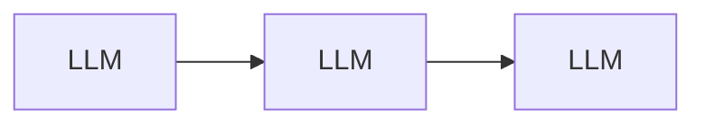
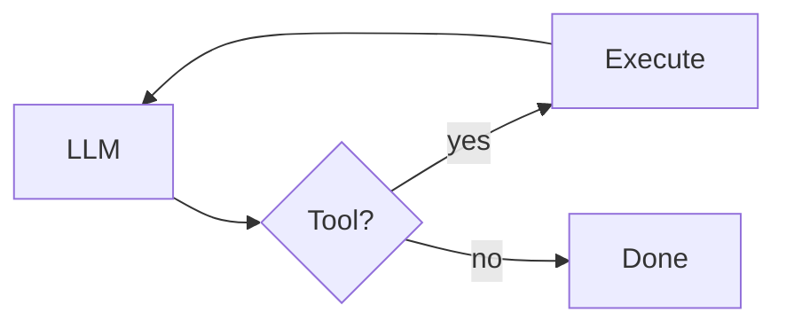
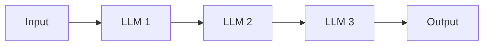
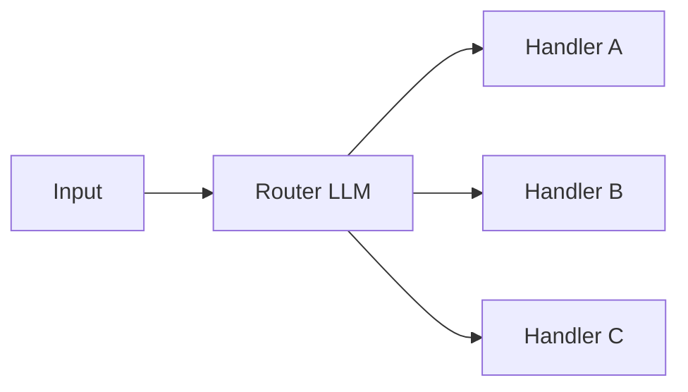
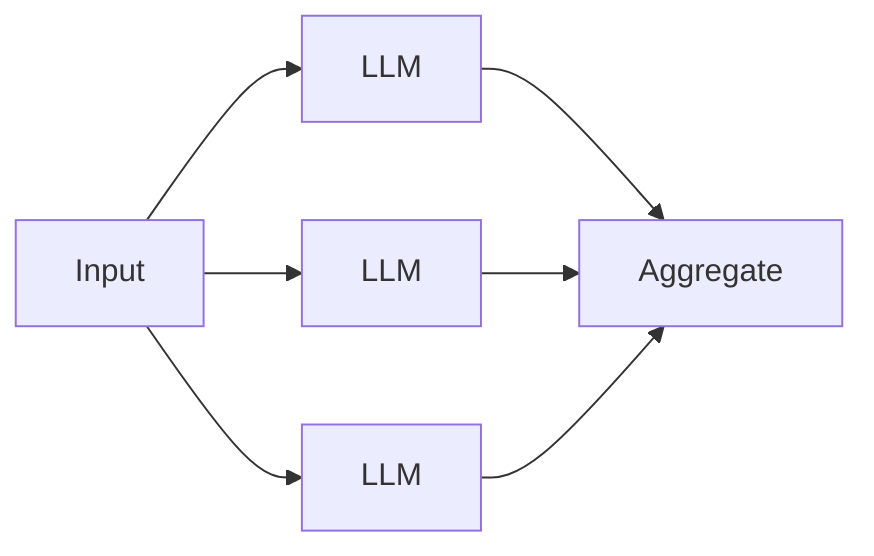
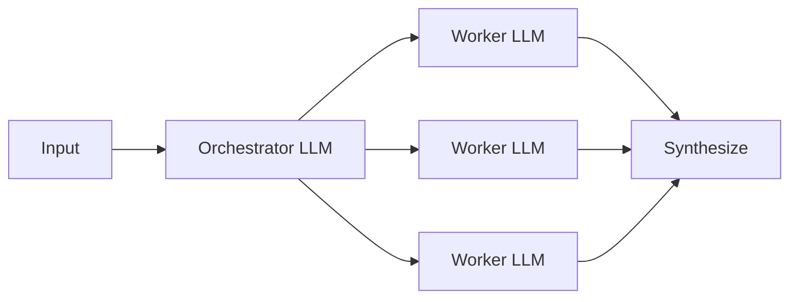
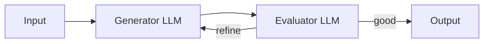
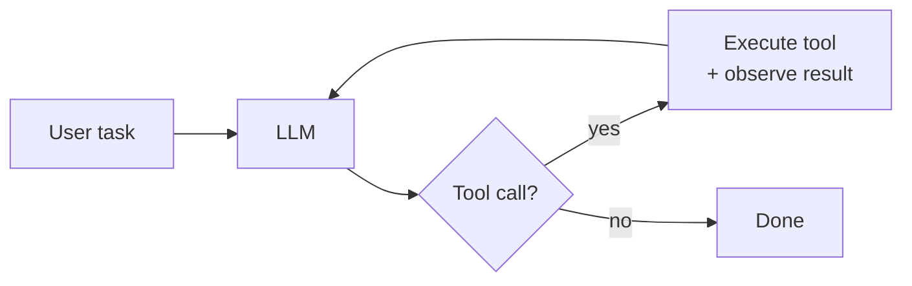
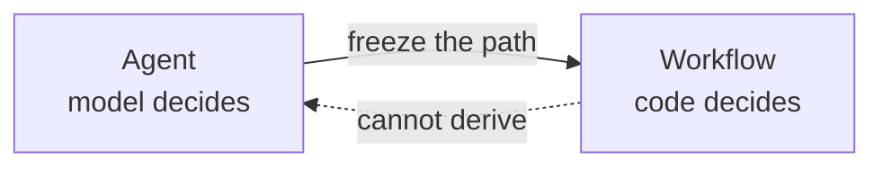

# agenteng

A framework-free take on **agentic engineering**.

## What is agentic engineering?

**Agentic engineering is the discipline of building agentic systems.**

Working in this discipline involves the following items:

- **Building the control flow** — the control flow determines the path the system takes
- **Designing tools** — what capabilities the system has, at what granularity, with what error semantics.
- **Architecting memory** — what's remembered, when it's remembered, and how it's retrieved
- **Managing context** — the context window is a budget of tokens; determine what goes into context and what gets evicted.
- **Handling safety/guardrails** — identity and access management, sandboxing, input/output detection, human approval gates, etc.
- **Setting up observability** — structured traces of every LLM call, tool call, and state transition to help with debugging and monitoring.
- **Building evaluations** — to benchmark the system's performance and ensure it is meeting the desired goals.
- **Managing cost and latency** — optimize costs and latency by caching, batching, model routing, parallelization, compression, etc.
- **Tuning prompts and context** — behavioral optimization via tuning the system prompt and context management.

## What are agentic systems?

The idea of agentic systems come from cognitive science, and is used to describe systems that can act on their own, without human intervention. In modern agentic systems, this agency is provided by an LLM.

## Types of agentic systems

In my opinion, agentic systems come in two forms: workflows and agents, as defined in Anthropic's [*Building Effective Agents*](https://www.anthropic.com/engineering/building-effective-agents):

Below are simple diagrams of the two types of agentic systems.

**Workflows** — systems where LLMs and tools are orchestrated through **predefined code paths**. Your code decides the sequence of steps and the model follows.

**Agents** — systems where **LLMs dynamically direct their own path through the control flow**. The model decides the sequence.

Below are more comprehensive diagrams of the two types of agentic systems.

### Common workflow patterns

**Prompt chaining** — LLM → LLM → LLM, fixed order. Example: outline → draft → polish.

**Routing** — Classify input → dispatch to one of N handlers. Example: support tickets routed to billing / technical / refunds.

**Parallelization** — Run N LLM calls in parallel → aggregate. Example: N perspectives on one question.

**Orchestrator-workers** — One LLM splits work → workers handle sub-tasks. Example: research report with multiple sections.

**Evaluator-optimizer** — Generator → Evaluator → loop until good. Example: draft with a quality-gate loop.

### Common agent patterns

Workflows are a catalog of orchestration shapes. Agents are **one pattern** — an autonomous loop — and that's the whole list. What varies between agents in practice is the environment, the toolkit, and whether one of the tools happens to be another agent.

**Autonomous agent** — an LLM in a loop with tools, choosing what to do next based on what it observes. This is the pattern this repo builds.

## Composition

By composing the above workflows and agent patterns, you can build multi-agent systems, multi-workflow systems, or systems that mix both.

> [!NOTE]
> **Whether to use multi-agent composition at all is a live disagreement in the field.** Anthropic embraces it ([multi-agent research system](https://www.anthropic.com/engineering/multi-agent-research-system); Claude Code subagents). Cognition argues *against* it in [*Don't Build Multi-Agents*](https://cognition.ai/blog/dont-build-multi-agents), making the case for a single-threaded linear agent with shared context — citing reliability and debuggability. Cursor 2.0 takes a third path: parallel independent agents on separate Git worktrees, no supervisor. The right composition depends on whether sub-tasks share context, run in parallel, and need to surface partial state — there is no default answer.

## The Average Joes Lab stance: purist agents only

We believe in the [Anthropic model](https://www.anthropic.com/engineering/building-effective-agents): **a real agent has autonomy over its own control flow.** The model decides what tool to call, what to do with the result, and when the task is done.

**A workflow is an LLM on rails it can't get off of.** Your code lays the track; the model fills in text at each stop.

This content sticks to that strict definition: only systems with autonomous control flow count as agents. Workflows are outside the scope of what follows.

The primitives are the same — LLM calls, tools, context, memory. An agent's control flow is the model making those choices live; a workflow's control flow is you making them in advance. The building blocks transfer; how you orchestrate them into a fixed sequence is its own discipline.

For most production systems a workflow is more reliable, cheaper, and easier to evaluate — build a workflow if you can. But the interesting engineering problems — designing tools the model will use well, managing an open-ended context, making a non-deterministic loop reliable, evaluating a trajectory you can't enumerate — are agent problems. If you want a workflow, compose the primitives from this content into the sequence your problem needs.

## What agents look like

Production examples:

- **Coding agents** — [Claude Code](https://claude.com/claude-code), [Cursor](https://cursor.com), [Devin](https://devin.ai), [Aider](https://aider.chat), [nanoagent](https://github.com/averagejoeslab/nanoagent). The model opens files, edits them, runs tests, iterates.
- **Research agents** — [OpenAI Deep Research](https://openai.com/index/introducing-deep-research/), Claude's research mode. The model searches, synthesizes, digs deeper.
- **Task completion agents** — [SWE-agent](https://swe-agent.com), browser-use agents. The model manipulates a filesystem or GUI to complete a task.

In each case, the next action depends on what the previous action produced. The paths can't be enumerated in advance.

> [!IMPORTANT]
> Most systems marketed as "agents" in 2026 are workflows. That's often the right answer. This content is about the case when it isn't.

## Setup

- Assumed programming experience (I will use Python as the example language)
- [Python 3.13 or newer](https://www.python.org/downloads/)
- [uv](https://docs.astral.sh/uv/) for dependency management
- An [Anthropic API key](https://console.anthropic.com) (or other model provider API key)

## Content

The curriculum is one straight line: start with a single LLM call and build outward, one capability at a time, until you reach a production-shaped coding agent. Each module pairs a prose explanation with a runnable checkpoint in [`examples/`](./examples/) — the file's name describes what the system has become at that step.

| # | Module | Checkpoint |
|---|---|---|
| 1 | [What is an agent?](./modules/01-what-is-an-agent/) — concept, three components, end-to-end sketch | *(no code)* |
| 2 | [An LLM call](./modules/02-an-llm-call/) — the Messages API; sync and async streaming | [`llm_call.py`](./examples/llm_call.py) |
| 3 | [Add a loop](./modules/03-add-a-loop/) — multi-turn conversation; the stateless chatbot | [`stateless_chatbot.py`](./examples/stateless_chatbot.py) |
| 4 | [Add memory](./modules/04-add-memory/) — persistence, token budget, semantic recall; the stateful chatbot | [`stateful_chatbot.py`](./examples/stateful_chatbot.py) |
| 5 | [Add tools](./modules/05-add-tools/) — one tool, the TAO loop, tool design, registry, toolkit, executor, async parallel dispatch; the stateful agent | [`agent.py`](./examples/agent.py) |
| 6 | [Add sandboxing](./modules/06-add-sandboxing/) — Docker isolation for the `bash` tool *(stubbed)* | [`sandbox_agent.py`](./examples/sandbox_agent.py) |
| 7 | [Add guardrails](./modules/07-add-guardrails/) — approval gates, loop bounds, retry/backoff *(stubbed)* | [`safe_agent.py`](./examples/safe_agent.py) |
| 8 | [Add observability](./modules/08-add-observability/) — structured spans, JSONL traces, replay *(stubbed)* | [`traced_agent.py`](./examples/traced_agent.py) |
| 9 | [Add evaluation](./modules/09-add-evaluation/) — task suites, LLM-as-judge, regression testing *(stubbed)* | [`evals/`](./evals/) |
| 10 | [Add performance](./modules/10-add-performance/) — prompt caching, tool caching, threading, streaming, structured prompts, `assemble()` *(stubbed)* | [`production_agent.py`](./examples/production_agent.py) |

Modules 1-5 are written end-to-end. Modules 6-10 are stubbed; their checkpoints in [`examples/`](./examples/) already implement what each one will describe — feel free to run those in the meantime.

## License

MIT
