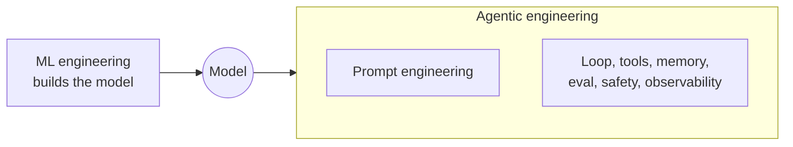
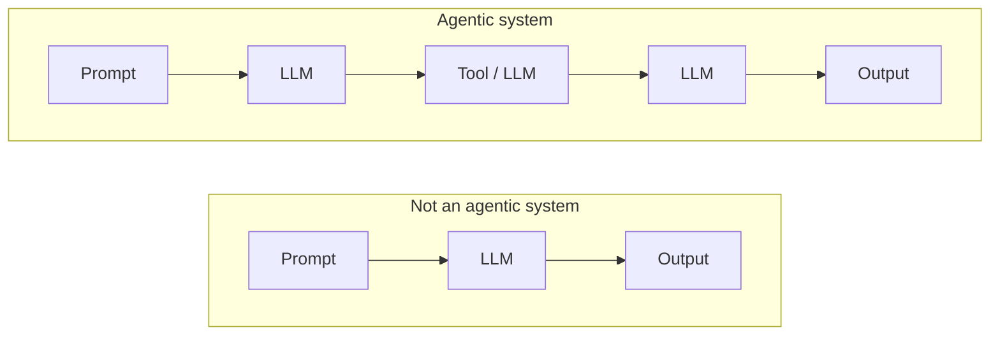
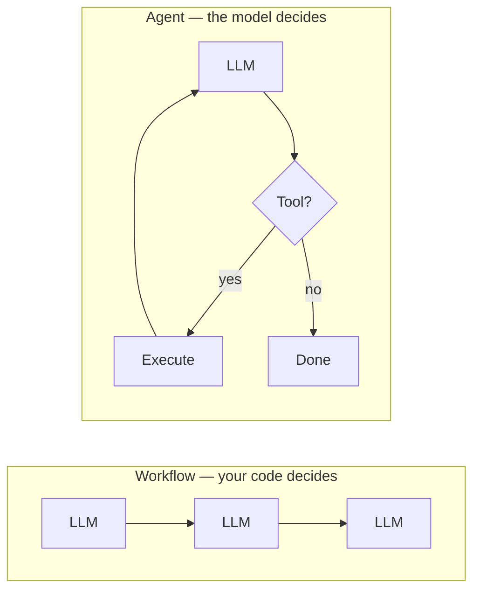
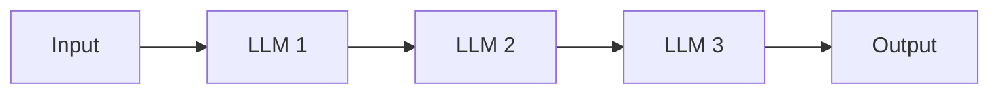
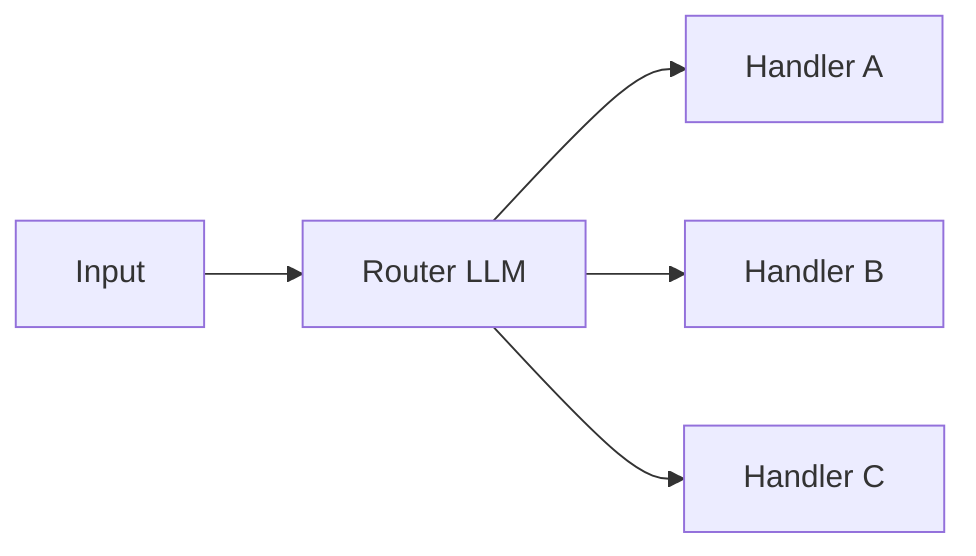
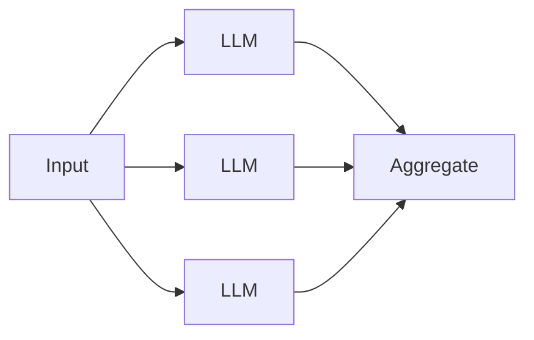
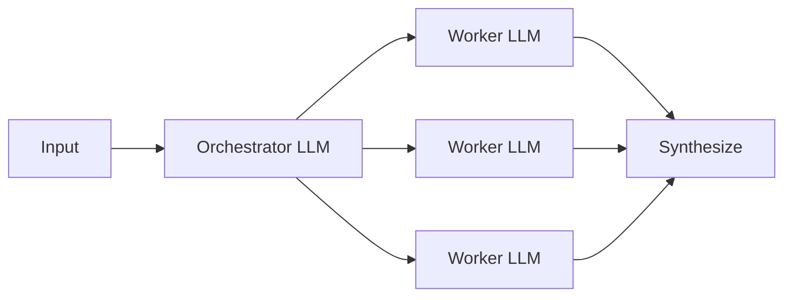
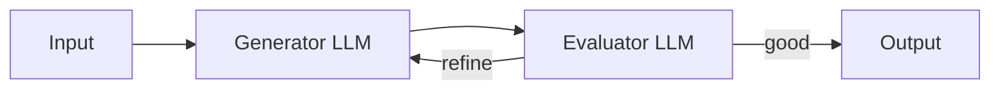
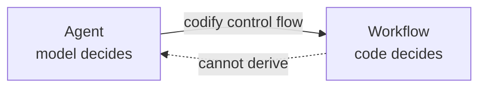

# Lesson 0: What is agentic engineering?

## What is agentic engineering?

**Agentic engineering is the discipline of building agentic systems.** If you call a model once and print the result, you don't need agentic engineering. If the model's output has to feed back into its next input — choosing tools, seeing results, deciding when to stop — you do.

### Where it sits

Agentic engineering is adjacent to four other disciplines that share some surface area but differ in what they work on:

| Discipline | Works on | Produces |
|---|---|---|
| **ML engineering** | The model's weights | Trained or fine-tuned models |
| **Prompt engineering** | One input to a fixed model | Better responses to one-shot queries |
| **Agentic engineering** | The system *around* the model | Multi-step systems: loops, tools, memory, evaluation |
| **Software engineering** | Deterministic code | Classical applications and services |

ML engineering builds the model. Prompt engineering tunes a single input to it. Agentic engineering builds everything else — the code around the model that makes it do multi-step work. Prompt engineering is a concern *inside* agentic engineering; good agents still need good prompts, but prompts alone don't make an agent.

### What makes it distinct

Agentic engineering inherits from classical software engineering but diverges on one property: **the system is non-deterministic, and control flow is partially delegated to the model.**

That one property breaks several software-engineering assumptions:

- **You can't enumerate edge cases** — the model chooses actions; the action space is open
- **You can't unit-test a trajectory** — every run takes a different path
- **Correctness becomes statistical** — "is this right?" becomes "how often does this work?"
- **Context is a live budget** — every tool call grows the conversation; every LLM call charges against a window
- **Debugging is trace-based** — stack traces don't help when the bug is a bad decision six steps ago

These are the problems that define agentic engineering as its own discipline. The model is the brain. Agentic engineering is the body, the reflexes, and the environment it operates in.

## What are agentic systems?

Agentic systems combine language models with tools to accomplish multi-step tasks. The model produces outputs (reasoning, tool requests, final answers), a control structure sequences those outputs, and tools let the system take actions beyond generating text.

What distinguishes agentic systems from single-shot LLM use is **coordination across steps** — each step's result informs the next. A one-off prompt-response is not an agentic system. A system that loops or pipelines multiple LLM calls coordinated with tool execution is.

## Types of agentic systems

Agentic systems come in two forms. The distinction is drawn sharply by Anthropic in [*Building Effective Agents*](https://www.anthropic.com/engineering/building-effective-agents):

**Workflows** — systems where LLMs and tools are orchestrated through **predefined code paths**. Your code decides the sequence of steps.

**Agents** — systems where **LLMs dynamically direct their own processes and tool usage**. The model decides the sequence.

Both are legitimate agentic systems. This curriculum subscribes to Anthropic's taxonomy.

### Common workflow patterns

Most production "AI apps" are workflows. The common patterns:

| Pattern | Control flow | Example |
|---|---|---|
| **Prompt chaining** | LLM → LLM → LLM, fixed order | outline → draft → polish |
| **Routing** | Classify input → dispatch to one of N handlers | support tickets routed to billing / technical / refunds |
| **Parallelization** | Run N LLM calls in parallel → aggregate | N perspectives on one question |
| **Orchestrator-workers** | One LLM splits work → workers handle sub-tasks | research report with multiple sections |
| **Evaluator-optimizer** | Generator → Evaluator → loop until good | draft with a quality-gate loop |

See the control flow of each pattern

**Prompt chaining**

**Routing**

**Parallelization**

**Orchestrator-workers**

**Evaluator-optimizer**

All of these are useful. All are workflows, not agents.

### What agents look like

Real agents are rarer because they're harder. Production examples:

- **Coding agents** — Claude Code, Cursor's agent mode, Devin, Aider. The model opens files, edits them, runs tests, iterates.
- **Research agents** — Deep Research, investigation systems. The model searches, synthesizes, digs deeper.
- **Task completion agents** — SWE-agent, browser-use agents. The model manipulates a filesystem or GUI to complete a task.

In each case, the next action depends on what the previous action produced. The paths can't be enumerated in advance.

> [!IMPORTANT]
> Most systems marketed as "agents" in 2026 are workflows. That's often the right answer. This curriculum is about the case when it isn't.

## What is an agentic engineer, and what do they do?

An agentic engineer designs, builds, and operates agentic systems. Part systems designer, part researcher, part debugger. The model is non-deterministic, so the work is less *"this is correct"* and more *"this is reliable enough."*

> [!NOTE]
> Broadly, the concerns fall into three buckets: **foundations** (tools, loop, memory, context), **observability and trust** (tracing, evaluation, safety), and **production economics** (cost, latency, prompts).

The day-to-day:

- **Design tools** — what capabilities the system has, at what granularity, with what error semantics
- **Build the loop or the orchestration** — the control structure that sequences LLM calls, whether the model or your code decides
- **Architect memory** — what's remembered within a task, across tasks, and how it's retrieved
- **Manage context** — the context window as a budget; what goes in, what gets summarized, what gets evicted
- **Set up observability** — structured traces of every LLM call, tool call, and state transition
- **Build evaluation** — task-completion suites, trajectory analysis, regression testing for non-deterministic systems
- **Handle safety** — sandboxing, prompt injection defenses, human approval gates for irreversible actions
- **Manage cost and latency** — caching, batching, model routing, parallelization
- **Tune prompts and context** — system prompts still matter; they're scaffolding inside the larger system now

## The Average Joes Lab stance: purist agents only

From Lesson 1 on, this curriculum is purist: **an agent is a system where the model directs its own control flow through a loop of tools, as defined in the next lesson.** Workflows are outside the scope of the teaching that follows.

We take this stance for one reason: **a workflow is just an agent with the control flow codified.** The pieces are the same (LLM calls, tools, context, memory), but *who decides the next step* shifts from the model to your code. Once you understand how an agent works, lifting the model's decision-making into your code gives you a workflow. The reverse doesn't hold.

For most production systems a workflow is more reliable, cheaper, and easier to evaluate — build a workflow if you can. But the interesting engineering problems — designing tools the model will actually use well, managing an open-ended context, making a non-deterministic loop reliable, evaluating a trajectory you can't enumerate — are agent problems. So we teach agents. If you want a workflow, you already have the ingredients.

---

**Next:** [Lesson 1: What is an agent?](../01-what-is-an-agent/)
