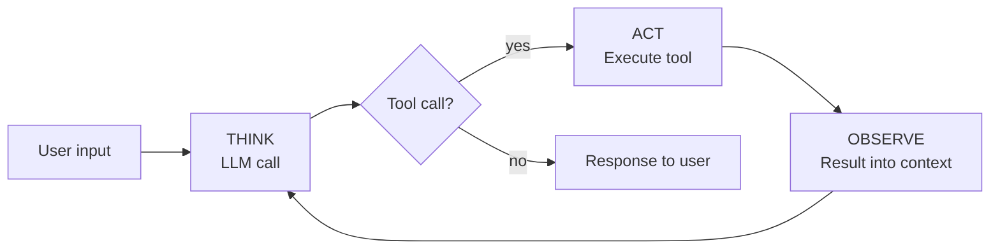

# Lesson 1: What is an agent?

## The definition

From Anthropic's [*Building Effective Agents*](https://www.anthropic.com/engineering/building-effective-agents):

> Agents are systems where LLMs dynamically direct their own processes and tool usage, maintaining control over how they accomplish tasks.

In plainer terms: **an agent is a reasoning engine within a TAO loop, with the ability to take actions.**

Both say the same thing. The key principle: **the model — not your code — decides what to do next.** If your code decides, you have a workflow, not an agent. This curriculum is about agents.

## The three ingredients

An agent has three moving parts:

1. **An LLM call** — the reasoning engine
2. **A TAO loop** (Think, Act, Observe) — the structure that turns single calls into sustained work
3. **Tools** — functions the LLM can invoke to take action

And one rule that binds them together: **the model directs the loop.** Your code runs the loop and executes tools, but the model decides *which* tool to call, *when*, and *when to stop*.

## The TAO cycle

Each iteration of the loop has three phases:

1. **THINK** — the LLM reasons about what to do
2. **ACT** — it chooses a tool to call
3. **OBSERVE** — the tool's result is fed back into its context

The cycle repeats: Think → Act → Observe → Think → ... until the model stops requesting tools. That's the end of the turn.

> [!NOTE]
> This loop is commonly known as the **ReAct loop** — after the 2022 paper [*ReAct: Synergizing Reasoning and Acting in Language Models*](https://arxiv.org/abs/2210.03629) by Yao et al. The ReAct acronym drops observation; TAO keeps it visible. (The paper itself includes observation — it's the acronym that's lossy.)

## In practice

With the concept in hand, the three ingredients are ordinary engineering pieces:

- **The LLM call** is an HTTP POST to the model provider's API, returning reasoning text and (optionally) a tool request in the same response
- **The loop** is a `while True:` that exits when the model stops requesting tools
- **Tools** are plain Python functions with a JSON schema (a `dict`) describing their inputs; your code runs them and appends the result to the conversation before calling the LLM again

What makes the system agentic isn't any one of these pieces — it's how they fit together so the model drives the control flow.



A concrete trace:

```
User: "Find and summarize the TODOs in this codebase"

[THINK]    I'll search for TODO comments
[ACT]      grep("TODO", ".")
[OBSERVE]  src/auth.ts:42:  // TODO: session expiration
           src/auth.ts:87:  // TODO: rate limiting
           src/db.ts:14:    // TODO: connection pooling
           ... (47 lines across 12 files)
[THINK]    Most are in src/auth.ts — I'll read that file for context
[ACT]      read("src/auth.ts")
[OBSERVE]  [full file contents]
[THINK]    I have enough to summarize
[STOP]     "You have 47 TODOs across 12 files, concentrated in auth..."
```

The model chose every action, read every result, and decided when to stop. No predetermined path — that's what the Anthropic definition means by *dynamically directing its own processes*.

## What we'll build

The next five lessons add one piece at a time:

| Lesson | Added | What it becomes |
|---|---|---|
| 2 | LLM call | A one-shot script |
| 3 | TAO loop (empty) | The loop structure with no tools to call |
| 4 | Terminal environment | An interactive REPL around the loop |
| 5 | First tool | **An agent** |
| 6 | More tools | A full toolkit |

By Lesson 6 you'll have a working coding agent in Python. Each lesson ends with something that runs.

## What you'll need

- [Python 3.13 or newer](https://www.python.org/downloads/)
- [uv](https://docs.astral.sh/uv/) for dependency management
- An Anthropic API key from [console.anthropic.com](https://console.anthropic.com)

---

**Next:** Lesson 2: A single LLM call *(coming soon)*
