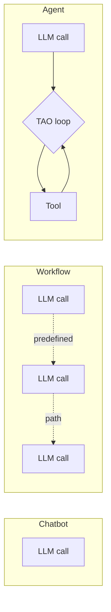

# Lesson 1: What is an agent?

You've used ChatGPT or Claude. You type a message, it responds with text. That's a **chatbot** — it can explain things, write code, answer questions. But it can't *do* anything.

An **agent** is different. An agent can act.

> **Chatbot:**
> *You:* "Create a hello world function in hello.ts"
> *Chatbot:* "Here's the code: `function hello() { console.log('Hello!'); }`"

The code was generated. But no file was created. Nothing happened on your computer.

> **Agent:**
> *You:* "Create a hello world function in hello.ts"
> *Agent:* *writes the file to disk*
> *Agent:* "I've created hello.ts with a hello world function."

The file now exists. The agent *acted*.

## The definition

An agent is a system with exactly three ingredients:

1. **An LLM call** — the reasoning engine
2. **A TAO loop** (Think, Act, Observe) — the structure that turns single calls into sustained thought
3. **Tools** — functions the LLM can invoke to take action

Remove any one and it's something else:

| Missing | What you have |
|---|---|
| LLM call | Deterministic code. Not intelligent. |
| Tools | A **chatbot**. It can think but can't act. |
| Loop | A **workflow**. Your code decides the next step, not the model. |

All three together, it's an agent. That's the whole definition.

## Chatbot vs. workflow vs. agent



The distinguishing feature across the three is **who decides the next step**:

| | LLM call | Tools | Loop | Who decides the next step? |
|---|:---:|:---:|:---:|---|
| **Chatbot** | ✓ | ✗ | ✗ | The user |
| **Workflow** | ✓ | sometimes | ✗ | Your code |
| **Agent** | ✓ | ✓ | ✓ | **The model** |

In an agent, the model looks at the situation, picks an action, does it, observes the result, and decides what to do next. Not your code. Not a predefined pipeline. The model.

> [!NOTE]
> Most production systems called "agents" are workflows. They have predefined control flow — classify input, route to a handler, summarize, done. Those are fine systems. They're often the right choice. They're just not agents by this definition, and this curriculum is about the other thing.

## The TAO loop

The loop has a simple shape: **Think, Act, Observe**.

1. **THINK** — the LLM reasons about what to do
2. **ACT** — it calls a tool
3. **OBSERVE** — it sees the result
4. **REPEAT** — it continues until the task is complete

> [!NOTE]
> This loop is commonly known as the **ReAct loop** — after the 2022 paper [*ReAct: Synergizing Reasoning and Acting in Language Models*](https://arxiv.org/abs/2210.03629) by Yao et al. The ReAct acronym (Reasoning + Acting) covers the first two steps; TAO makes all three visible. We'll use TAO throughout this curriculum because the third step — observation — is what makes it a *loop* rather than a chain.

A concrete example:

```
User: "Find and summarize the TODOs in this codebase"

[THINK]    I need to find files containing "TODO"
[ACT]      grep("TODO", ".") → list of matches
[OBSERVE]  47 TODO comments across 12 files
[THINK]    I'll look at the file with the most TODOs first
[ACT]      read("src/auth.ts") → file contents
[OBSERVE]  8 TODOs in this file, mostly about session handling
[THINK]    I have enough to summarize
[STOP]     "You have 47 TODOs across 12 files, concentrated in..."
```

The model decides what tools to use, when to use them, and when to stop. Your code provides the tools and runs the loop.

## What we'll build

Over the next five lessons we'll build each ingredient in order:

| Lesson | Ingredient added | What it becomes |
|---|---|---|
| 2 | LLM call | A one-shot script |
| 3 | TAO loop (empty) | The structure, with the tool slots empty |
| 4 | Terminal environment | An interactive chatbot in a REPL |
| 5 | First tool | **A proper agent** |
| 6 | More tools | A full toolkit |

By the end of Lesson 6 you'll have a working coding agent in ~200 lines of TypeScript. Each lesson adds one thing. Each lesson ends with something that runs.

> [!TIP]
> There's nothing magical about any single ingredient. The LLM call is an HTTP POST. The loop is a `while(true)`. Tools are functions. What's interesting is how they fit together — and that's what you'll feel as you build them.

## What you'll need

- [Bun](https://bun.sh) — `curl -fsSL https://bun.sh/install | bash`
- An Anthropic API key from [console.anthropic.com](https://console.anthropic.com)

Let's start with the LLM call.

---

**Next:** Lesson 2: A single LLM call *(coming soon)*
