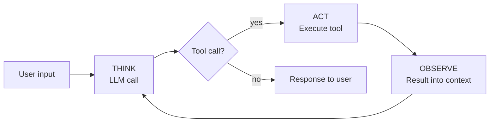

# Lesson 1: What is an agent?

You ask: *"Create a hello world function in hello.ts."*

The agent calls `write("hello.ts", "function hello() { ... }")` and replies: *"Done — hello.ts created."*

The file now exists on disk. The agent *acted*. That's the whole idea — but we need to be precise about what "agent" means.

## The definition

From Anthropic's [*Building Effective Agents*](https://www.anthropic.com/engineering/building-effective-agents):

> Agents are systems where LLMs dynamically direct their own processes and tool usage, maintaining control over how they accomplish tasks.

That's the definition this curriculum commits to. **The model — not your code — decides what to do next.** If your code decides, you have a workflow, not an agent. This curriculum is about agents.

## The three ingredients

An agent has three moving parts:

1. **An LLM call** — the reasoning engine
2. **A TAO loop** (Think, Act, Observe) — the structure that turns single calls into sustained work
3. **Tools** — functions the LLM can invoke to take action

And one rule that binds them together: **the model directs the loop.** Your code runs the loop and executes tools, but the model decides *which* tool to call, *when*, and *when to stop*.

## The TAO loop

Each iteration has three phases: **Think, Act, Observe**.



1. **THINK** — the LLM reasons about what to do
2. **ACT** — it calls a tool
3. **OBSERVE** — it sees the result
4. **REPEAT** — until the model produces no more tool calls

THINK and ACT happen inside a single LLM response: the model emits reasoning text and a tool request in the same output. Your code handles execution (ACT) and feeds the result back (OBSERVE) on the next iteration. The loop ends when the model stops requesting tools.

> [!NOTE]
> This loop is commonly known as the **ReAct loop** — after the 2022 paper [*ReAct: Synergizing Reasoning and Acting in Language Models*](https://arxiv.org/abs/2210.03629) by Yao et al. The ReAct acronym drops observation; TAO keeps it visible. (The paper itself includes observation — it's the acronym that's lossy.)

## A concrete trace

```
User: "Find and summarize the TODOs in this codebase"

[THINK]    I'll search for TODO comments
[ACT]      grep("TODO", ".")
[OBSERVE]  src/auth.ts:42:  // TODO: session expiration
           src/auth.ts:87:  // TODO: rate limiting
           src/db.ts:14:    // TODO: connection pooling
           ... (47 lines across 12 files)
[THINK]    Most are in src/auth.ts — I'll read that file for context
[ACT]      read("src/auth.ts")
[OBSERVE]  [full file contents]
[THINK]    I have enough to summarize
[STOP]     "You have 47 TODOs across 12 files, concentrated in auth..."
```

The model chose every action, read every result, and decided when to stop. No predetermined path. That's what the Anthropic definition means by *dynamically directing its own processes*.

## What we'll build

The next five lessons add one piece at a time:

| Lesson | Added | What it becomes |
|---|---|---|
| 2 | LLM call | A one-shot script |
| 3 | TAO loop (empty) | The loop structure with no tools to call |
| 4 | Terminal environment | An interactive REPL around the loop |
| 5 | First tool | **An agent** |
| 6 | More tools | A full toolkit |

By Lesson 6 you'll have a working coding agent in ~200 lines of TypeScript. Each lesson ends with something that runs.

> [!TIP]
> There's nothing magical about the ingredients. The LLM call is an HTTP POST. The loop is a `while(true)`. Tools are functions. What's interesting is how they fit together.

## What you'll need

- [Bun](https://bun.sh) — `curl -fsSL https://bun.sh/install | bash`
- An Anthropic API key from [console.anthropic.com](https://console.anthropic.com)

---

**Next:** Lesson 2: A single LLM call *(coming soon)*
