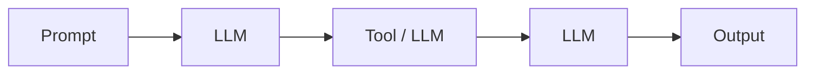
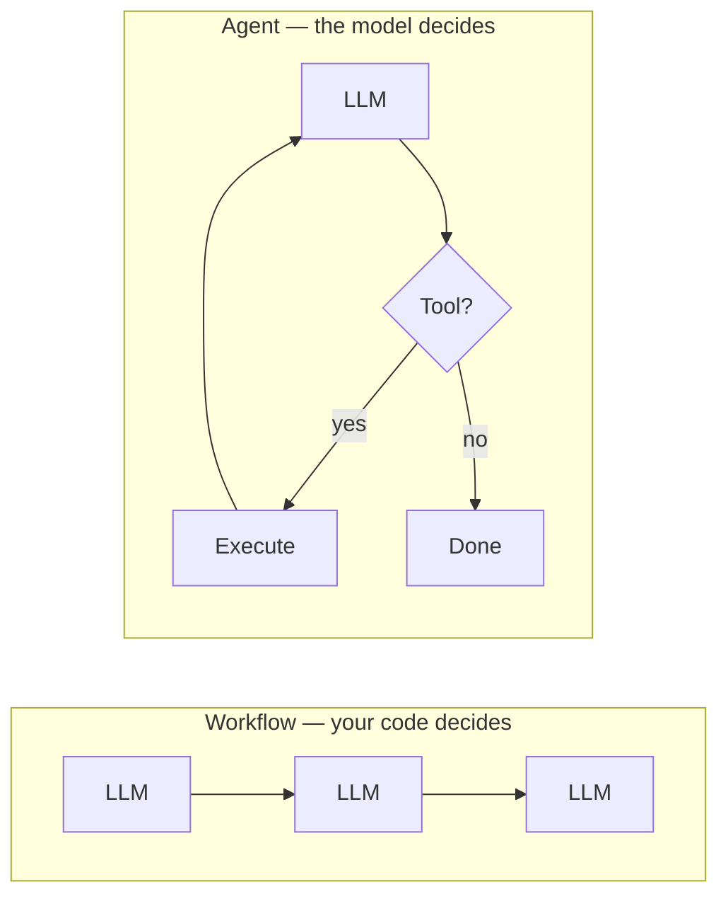
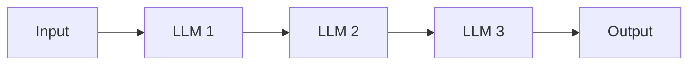
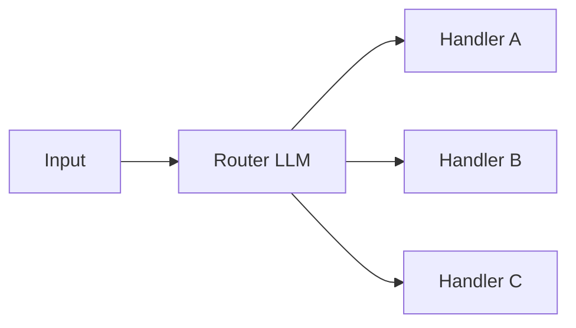
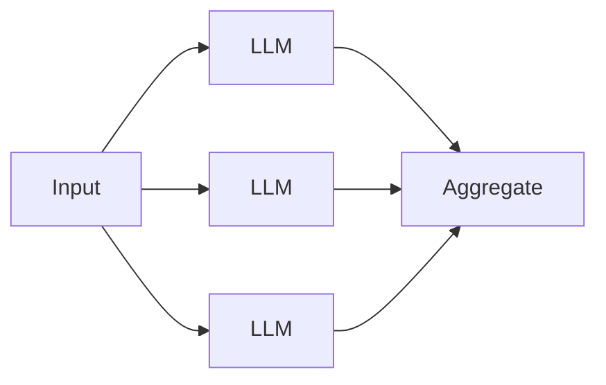
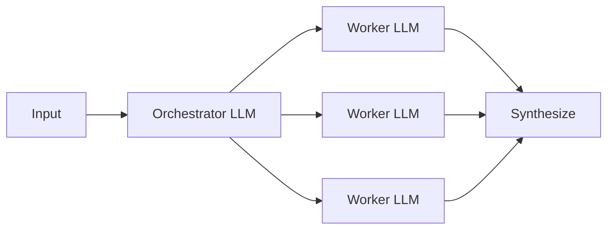
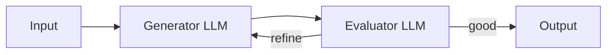
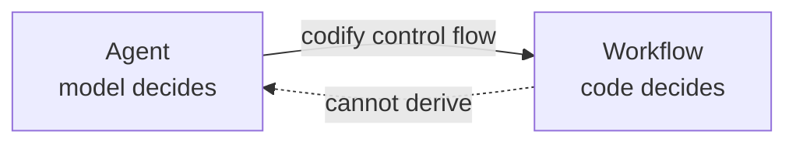

# What is agentic engineering?

**Agentic engineering is the discipline of building agentic systems.**

Working in this discipline involves the following items:

- **Building the control flow** — the control flow determines the path the system takes
- **Designing tools** — what capabilities the system has, at what granularity, with what error semantics. See [Model Context Protocol](https://modelcontextprotocol.io) for one standardization effort.
- **Architecting memory** — what's remembered, when it's remembered, and how it's retrieved
- **Managing context** — the context window is a budget of tokens; determine how it is managed by what goes in and what gets evicted.
- **Setting up observability** — structured traces of every LLM call, tool call, and state transition in the control flow.
- **Building evaluations** — task-completion suites, trajectory analysis, regression testing for non-deterministic systems
- **Handling safety/guardrails** — identity and access management, sandboxing, input/output detection systems, human approval gates
- **Managing cost and latency** — caching, batching, model routing, parallelization, compression, etc.
- **Tuning prompts and context** — the system prompt is scaffolding inside the larger system

> [!NOTE]
> These fall into three buckets: **foundations** (control flow, tools, memory, context), **observability and trust** (tracing, evaluation, safety), and **production economics** (cost, latency, prompts).

## What are agentic systems?

**An agentic system coordinates more than one LLM call to accomplish a goal.** The term comes from Anthropic's [*Building Effective Agents*](https://www.anthropic.com/engineering/building-effective-agents), where it serves as an umbrella covering both workflows and agents. A control flow determines the sequence of calls; each step's output feeds into the next.

## Types of agentic systems

Agentic systems come in two forms, as defined in Anthropic's [*Building Effective Agents*](https://www.anthropic.com/engineering/building-effective-agents):

**Workflows** — systems where LLMs and tools are orchestrated through **predefined code paths**. Your code decides the sequence of steps.

**Agents** — systems where **LLMs dynamically direct their own processes and tool usage**. The model decides the sequence.

Both are legitimate agentic systems. This content subscribes to Anthropic's taxonomy.

### Common workflow patterns

| Pattern | Control flow | Example |
|---|---|---|
| **Prompt chaining** | LLM → LLM → LLM, fixed order | outline → draft → polish |
| **Routing** | Classify input → dispatch to one of N handlers | support tickets routed to billing / technical / refunds |
| **Parallelization** | Run N LLM calls in parallel → aggregate | N perspectives on one question |
| **Orchestrator-workers** | One LLM splits work → workers handle sub-tasks | research report with multiple sections |
| **Evaluator-optimizer** | Generator → Evaluator → loop until good | draft with a quality-gate loop |

#### Control flow of each pattern

**Prompt chaining**

**Routing**

**Parallelization**

**Orchestrator-workers**

**Evaluator-optimizer**

## The Average Joes Lab stance: purist agents only

We believe in the [Anthropic model](https://www.anthropic.com/engineering/building-effective-agents): **a real agent has autonomy over its own control flow.** The model decides what tool to call, what to do with the result, and when the task is done. No predetermined path.

**A workflow is an LLM on rails it can't get off of.** Your code lays the track; the model fills in text at each stop.

From Module 1 on, this content is purist: only systems with autonomous control flow count as agents. Workflows are outside the scope of what follows.

The pieces are the same — LLM calls, tools, context, memory — but *who decides the next step* shifts from the model (agent) to your code (workflow). Understanding agents → understanding workflows; the reverse doesn't hold.

For most production systems a workflow is more reliable, cheaper, and easier to evaluate — build a workflow if you can. But the interesting engineering problems — designing tools the model will use well, managing an open-ended context, making a non-deterministic loop reliable, evaluating a trajectory you can't enumerate — are agent problems. If you want a workflow, you already have the ingredients.

## What agents look like

Production examples:

- **Coding agents** — [Claude Code](https://claude.com/claude-code), [Cursor](https://cursor.com), [Devin](https://devin.ai), [Aider](https://aider.chat), [nanoagent](https://github.com/averagejoeslab/nanoagent). The model opens files, edits them, runs tests, iterates.
- **Research agents** — [OpenAI Deep Research](https://openai.com/index/introducing-deep-research/), Claude's research mode. The model searches, synthesizes, digs deeper.
- **Task completion agents** — [SWE-agent](https://swe-agent.com), browser-use agents. The model manipulates a filesystem or GUI to complete a task.

In each case, the next action depends on what the previous action produced. The paths can't be enumerated in advance.

> [!IMPORTANT]
> Most systems marketed as "agents" in 2026 are workflows. That's often the right answer. This content is about the case when it isn't.

---

**Next:** [Module 1: What is an agent?](../01-what-is-an-agent/)
