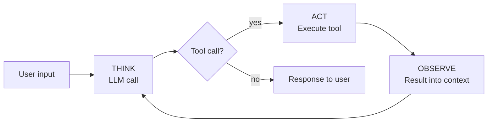

# What is an agent?

An agent is an LLM within a loop where it can think, act, and observe within an environment. This module names the ingredients; the next five build them.

## The three ingredients

An agent has three moving parts:

1. **An LLM call** — the reasoning engine
2. **A TAO loop** (Think, Act, Observe) — the structure that turns single calls into sustained work
3. **Tools** — the agent's means of acting on its environment

## The TAO cycle

Each iteration of the loop has three phases:

1. **THINK** — the LLM runs; it emits reasoning text and (optionally) tool requests
2. **ACT** — your code executes the tools the model requested
3. **OBSERVE** — the results are appended to the conversation

The cycle repeats: Think → Act → Observe → Think → ... until the model stops requesting tools. That's the end of the turn.

> [!NOTE]
> This loop is commonly known as the **ReAct loop** — after the 2022 paper [*ReAct: Synergizing Reasoning and Acting in Language Models*](https://arxiv.org/abs/2210.03629) by Yao et al. The ReAct acronym drops observation; TAO keeps it visible. (The paper itself includes observation — it's the acronym that's lossy.)

## In practice

The three ingredients are ordinary engineering pieces:

- **The LLM call** is an HTTP POST to the model provider's API, returning reasoning text and (optionally) a tool request in the same response
- **The loop** is a `while True:` that exits when the model stops requesting tools
- **Tools** are plain Python functions with a JSON schema (a `dict`) describing their inputs; your code runs them and appends the result to the conversation before calling the LLM again

The shape in code:

```python
import os
from anthropic import Anthropic

client = Anthropic(api_key=os.environ["ANTHROPIC_API_KEY"])

# A minimal tool
def add(a: int, b: int) -> str:
    return str(a + b)

tools = [
    {
        "name": "add",
        "description": "Add two numbers",
        "input_schema": {
            "type": "object",
            "properties": {
                "a": {"type": "number"},
                "b": {"type": "number"},
            },
            "required": ["a", "b"],
        },
    }
]

messages = [{"role": "user", "content": "What is 2 + 2? Use the add tool."}]

while True:
    # THINK: the LLM runs; it emits text + optional tool requests
    response = client.messages.create(
        model="claude-sonnet-4-5",
        max_tokens=1024,
        messages=messages,
        tools=tools,
    )
    messages.append({"role": "assistant", "content": response.content})

    # No tool requests → the model is done
    tool_calls = [b for b in response.content if b.type == "tool_use"]
    if not tool_calls:
        break

    # ACT: execute the tools the model requested
    results = []
    for call in tool_calls:
        output = add(**call.input)
        results.append({
            "type": "tool_result",
            "tool_use_id": call.id,
            "content": output,
        })

    # OBSERVE: append the results to the conversation
    messages.append({"role": "user", "content": results})

# Print the final text from the model
for block in response.content:
    if block.type == "text":
        print(block.text)
```

Setup (API key, `uv`, dependencies) comes in [Module 2](../02-a-single-llm-call/); the pieces — LLM call, loop, environment, tools — are built up one at a time across Modules 2–4.



A concrete trace:

```
User: "Find and summarize the TODOs in this codebase"

[THINK]    I'll search for TODO comments
[ACT]      grep("TODO", ".")
[OBSERVE]  src/auth.ts:42:  // TODO: session expiration
           src/auth.ts:87:  // TODO: rate limiting
           src/db.ts:14:    // TODO: connection pooling
           [...44 more matches]
[THINK]    Most are in src/auth.ts — I'll read that file for context
[ACT]      read("src/auth.ts")
[OBSERVE]  [full file contents]
[THINK]    I have enough to summarize
[STOP]     "You have 47 TODOs across 12 files, concentrated in auth..."
```

The model chose every action, read every result, and decided when to stop.

## What we'll build

The next three modules add one piece at a time:

| Module | Added | What it becomes |
|---|---|---|
| 2 | LLM call | A one-shot script |
| 3 | TAO loop + terminal environment | An interactive REPL running the loop |
| 4 | Tools | **An agent** |

By Module 4 you'll have a working coding agent in Python. Each module ends with something that runs.

## What you'll need

- [Python 3.13 or newer](https://www.python.org/downloads/)
- [uv](https://docs.astral.sh/uv/) for dependency management
- An Anthropic API key from [console.anthropic.com](https://console.anthropic.com)

---

**Next:** [Module 2: A single LLM call](../02-a-single-llm-call/)
