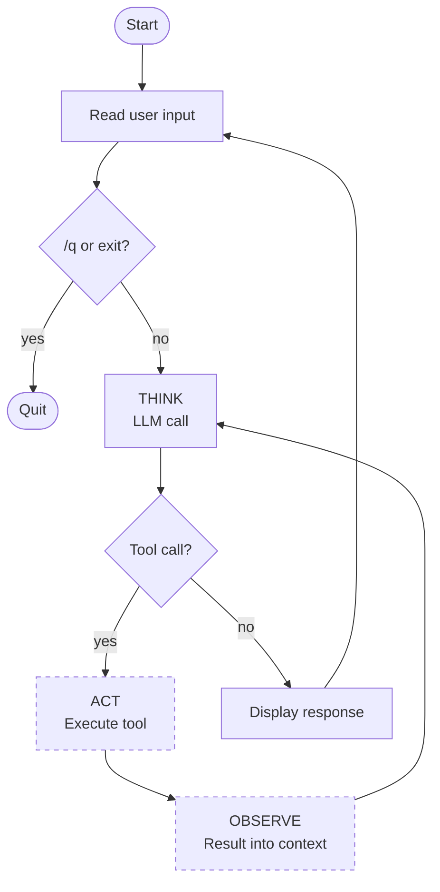

# The TAO loop

This module wraps the single LLM call from Module 2 in two loops: the **TAO loop** (Think, Act, Observe) and a **terminal REPL** that gives it somewhere to run. A loop isn't useful without an environment — so we build them together. The loop exits after one iteration for now (no tools to call), but the runtime shape is complete: you'll type prompts, the model will respond, the REPL will wait for the next prompt.

## The loop's shape

Each iteration of the TAO loop has three phases:

1. **THINK** — the LLM runs; it emits text and (optionally) tool requests
2. **ACT** — your code executes the tools the model requested
3. **OBSERVE** — the results are appended to the conversation

The TAO loop repeats until the model produces no tool requests — that's the stop condition. A single turn can involve many LLM calls.

## The environment

An agent doesn't run in isolation — it needs somewhere to receive input, produce output, and eventually act. The simplest environment is a **terminal REPL**: read a prompt, run the TAO loop, show the response, repeat. The REPL is the outer loop; the TAO loop is the inner one.



> [!NOTE]
> The dashed boxes (ACT, OBSERVE) are inactive because we haven't added tools yet. The inner TAO loop always exits on the first iteration — the model has no tools to request. In Module 4 those paths activate and the TAO loop starts iterating within a single REPL turn.

## The code

Extend `main.py`:

```python
import os
from anthropic import Anthropic

client = Anthropic(api_key=os.environ["ANTHROPIC_API_KEY"])
messages = []

while True:
    # The terminal environment: read a user prompt
    user_input = input("❯ ")
    if user_input.lower() in ("/q", "exit"):
        break

    messages.append({"role": "user", "content": user_input})

    # The TAO loop: iterate until the model stops requesting tools
    while True:
        # THINK: call the model
        response = client.messages.create(
            model="claude-sonnet-4-5",
            max_tokens=1024,
            system="You are a helpful assistant.",
            messages=messages,
        )
        messages.append({"role": "assistant", "content": response.content})

        # Display any text the model produced
        for block in response.content:
            if block.type == "text":
                print(block.text)

        # If the model didn't ask for tools, we're done with this turn
        tool_calls = [b for b in response.content if b.type == "tool_use"]
        if not tool_calls:
            break

        # ACT: execute the tools (Module 4 fills this in)
        # OBSERVE: feed the results back as a user message (Module 4 fills this in)
```

Two nested loops are now visible in the code:

- **Outer** `while True` — the REPL. Reads prompts until you type `/q` or `exit`.
- **Inner** `while True` — the TAO loop. Iterates until the model stops requesting tools.

`messages` lives outside the REPL loop so conversation state persists across turns.

## Running it

```bash
uv run main.py
```

Interactive session:

```
❯ What is 2 + 2?
4
❯ What did I just ask you?
You asked what 2 + 2 equals.
❯ /q
```

The model remembers the previous turn because `messages` accumulates across REPL turns.

## Why the TAO loop still exits immediately

Each REPL turn:

1. You type a prompt; it's appended to `messages`
2. The LLM is called — it returns a response with one `text` block and zero `tool_use` blocks (no tools were provided)
3. The text is printed
4. `tool_calls` is an empty list → inner `break`
5. Control returns to the outer REPL loop, ready for the next prompt

The model wasn't given any tools, so it couldn't request any. The inner TAO loop runs exactly once per REPL turn.

## What we've done

The runtime shape is complete: a REPL that wraps a TAO loop. Prompts go in, responses come out, conversation state persists. The only thing missing is the ability to *act* — the ACT and OBSERVE phases are stubbed. Module 4 fills them in with tools, and the inner loop finally starts iterating.

## What's missing

- **No tools.** The model can only produce text. When it can't solve a problem from pure knowledge, it has no way to go look things up or do anything about it. Module 4 adds tools — and the system becomes a proper agent.

---

**Next:** Module 4: Tools *(coming soon)*
