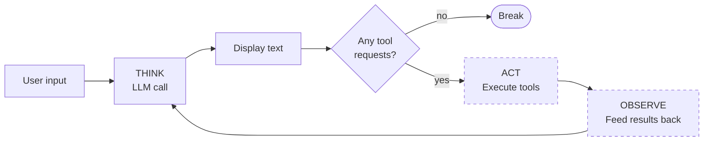

# The TAO loop

This module wraps the single LLM call from the previous module in a loop — the same shape the agent will use once it has tools. The loop exits after one iteration for now (no tools to call), but laying the track means tools slot in exactly where they belong in Module 5.

## The loop's shape

Each iteration has three phases: **Think, Act, Observe**.

1. **THINK** — call the LLM; it produces reasoning text and (optionally) tool requests
2. **ACT** — if there are tool requests, execute them
3. **OBSERVE** — feed the results back to the model as the next user message

The loop repeats until the model produces no more tool requests — that's the stop condition.



> [!NOTE]
> The dashed boxes are the ACT and OBSERVE phases. They don't run yet — we haven't added tools. The loop exits on the first iteration because the model has no tools to request. In Module 5 those paths activate.

## The code

Extend `main.py`:

```python
import os
from anthropic import Anthropic

client = Anthropic(api_key=os.environ["ANTHROPIC_API_KEY"])

messages = [
    {"role": "user", "content": "What is 2 + 2?"}
]

while True:
    # THINK: call the model
    response = client.messages.create(
        model="claude-sonnet-4-5",
        max_tokens=1024,
        system="You are a helpful assistant.",
        messages=messages,
    )

    # Display any text the model produced
    for block in response.content:
        if block.type == "text":
            print(block.text)

    # Add the assistant's response to the conversation
    messages.append({"role": "assistant", "content": response.content})

    # Find any tool requests
    tool_calls = [b for b in response.content if b.type == "tool_use"]

    # If the model didn't ask for tools, we're done
    if not tool_calls:
        break

    # ACT: execute the tools (Module 5 fills this in)
    # OBSERVE: feed the results back as a user message (Module 5 fills this in)
```

## Running it

```bash
uv run main.py
```

Expected output:

```
4
```

Same answer as Module 2 — the call is inside a loop now, but the loop runs exactly once.

## Why the loop exits immediately

Trace the first iteration:

1. `messages` starts with the user's question
2. The LLM returns a response with one `text` block and zero `tool_use` blocks
3. The text block gets printed
4. The assistant response is appended to `messages`
5. `tool_calls` is an empty list
6. `if not tool_calls:` is true → `break`

The model wasn't given any tools, so it couldn't request any. With nothing to ACT on, the loop exits.

## What we've done

The shape of the agentic loop is now in the code. Every agent has this structure. The interesting parts (tools, environment) slot into the commented lines in later modules.

## What's missing

- **No interactivity.** One input, one run, done. Module 4 wraps this in a REPL.
- **No tools.** The loop can't take action. Module 5 adds tools — and the loop actually starts iterating.

---

**Next:** Module 4: The terminal environment *(coming soon)*
