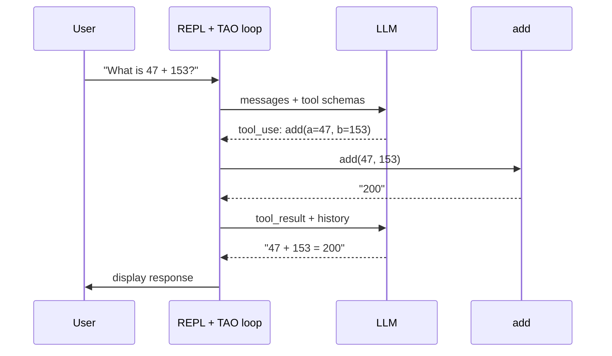

# First tool

This module adds a single tool to the REPL agent from Module 3. With one tool in place, the TAO loop finally iterates — the model decides when to call it, your code executes it, the result flows back. The system crosses the threshold from "chatbot in a loop" to **minimal agent**.

## The tool-use protocol

When the LLM has tools, it can emit `tool_use` blocks in its response. Each is a structured request:

- **`id`** — unique identifier for this specific call
- **`name`** — which tool to run
- **`input`** — the arguments (a dict matching the tool's schema)

Your code runs the tool with those arguments and feeds the result back as a `tool_result` block, matched by `tool_use_id`. That's the contract: the model asks, your code answers, the model keeps going.



## Defining a tool

A tool is two pieces: a Python function that does the work, and a schema that tells the model how to call it.

```python
def add(a: int, b: int) -> str:
    return str(a + b)

tools = [
    {
        "name": "add",
        "description": "Add two numbers",
        "input_schema": {
            "type": "object",
            "properties": {
                "a": {"type": "number"},
                "b": {"type": "number"},
            },
            "required": ["a", "b"],
        },
    }
]
```

The schema is a [JSON Schema](https://json-schema.org/) dict. Two fields matter for now:

- **`properties`** — what arguments the tool takes and their types
- **`required`** — which arguments are mandatory

The tool returns a string. Numbers, JSON, free text — whatever the model needs to read.

## Wiring it into the loop

Extend `main.py` from Module 3:

```python
import os
from anthropic import Anthropic
from dotenv import load_dotenv

load_dotenv()

client = Anthropic(api_key=os.environ["ANTHROPIC_API_KEY"])
messages = []

# The tool
def add(a: int, b: int) -> str:
    return str(a + b)

tools = [
    {
        "name": "add",
        "description": "Add two numbers",
        "input_schema": {
            "type": "object",
            "properties": {
                "a": {"type": "number"},
                "b": {"type": "number"},
            },
            "required": ["a", "b"],
        },
    }
]

while True:
    # The terminal environment: read a user prompt
    user_input = input("❯ ")
    if user_input.lower() in ("/q", "exit"):
        break

    messages.append({"role": "user", "content": user_input})

    # The TAO loop: iterate until the model stops requesting tools
    while True:
        # THINK: call the model (now with tools)
        response = client.messages.create(
            model="claude-sonnet-4-5",
            max_tokens=1024,
            system="You are a helpful assistant. Use the add tool when you need to add two numbers.",
            messages=messages,
            tools=tools,
        )
        messages.append({"role": "assistant", "content": response.content})

        # Display any text the model produced
        for block in response.content:
            if block.type == "text":
                print(block.text)

        # If the model didn't ask for tools, we're done with this turn
        tool_calls = [b for b in response.content if b.type == "tool_use"]
        if not tool_calls:
            break

        # ACT: execute each tool the model requested
        results = []
        for call in tool_calls:
            if call.name == "add":
                output = add(**call.input)
            else:
                output = f"error: unknown tool {call.name}"
            results.append({
                "type": "tool_result",
                "tool_use_id": call.id,
                "content": output,
            })

        # OBSERVE: append results as the next user message
        messages.append({"role": "user", "content": results})
```

Three changes from Module 3:

1. **`tools=tools`** added to the `create()` call — gives the model the schema.
2. **ACT section** fills the stub — executes each requested tool. The `if call.name == "add"` dispatch is minimal for now; Part 2 replaces it with a proper registry.
3. **OBSERVE section** fills the stub — packages results as `tool_result` blocks with matching `tool_use_id`, then appends them as a user message so the model sees them on the next iteration.

## Running it

```bash
uv run main.py
```

A session:

```
❯ What is 47 + 153?
I'll use the add tool to calculate that.
47 + 153 = 200
❯ What about 8 + 12?
8 + 12 = 20
❯ /q
```

The TAO loop now runs **multiple iterations per REPL turn**:

1. **THINK** — model sees the question, emits `tool_use: add(a=47, b=153)`
2. **ACT** — your code runs `add(47, 153)` → `"200"`
3. **OBSERVE** — result appended to messages
4. **THINK (again)** — model now has the result, produces text: *"47 + 153 = 200"*
5. No more tool requests → break out of the TAO loop, return to REPL

The dashed boxes in Module 3's diagram are now solid.

## What just changed

- **The TAO loop actually iterates.** Before, it ran exactly once per REPL turn (no tools to request). Now every tool call causes at least one extra iteration.
- **The model directs the flow.** Your code didn't decide to call `add` — the model did. Your code just executed what was asked for.
- **The system has autonomy over its own control flow.** Given a question it can't answer directly, the model reaches for a tool; given a result, it decides what to say next.

By the [Anthropic definition](https://www.anthropic.com/engineering/building-effective-agents) from Module 0, this is an agent. Not a chatbot (has tools), not a workflow (the model directs the sequence).

## What's next

The agent works, but it's minimal:

- **Only one tool.** Real agents have toolkits — read files, write files, search, execute code.
- **The executor is ad-hoc.** The `if call.name == "add"` dispatch doesn't scale past a handful of tools.
- **No error handling.** A tool that raises an exception crashes the loop instead of letting the model self-correct.
- **No memory across sessions.** The conversation resets every time you restart the REPL.

Part 2 (Tool Design) addresses the first three: a proper tool registry, dispatching executor, and error-message design. Part 3 (Memory and Context) handles the fourth.

## Prompt your coding agent

If you want your coding agent to write this for you, paste:

```
Extend main.py from the previous module by adding a single tool called "add":

1. Define `def add(a, b) -> str` that returns str(a + b)
2. Define a `tools` list with one entry:
   - name: "add"
   - description: "Add two numbers"
   - input_schema: JSON Schema dict with properties "a" and "b" (both numbers), both required
3. Pass tools=tools to the messages.create call
4. Update the system prompt to mention the add tool is available for arithmetic
5. Fill the ACT stub: for each tool_use block in the response, dispatch on call.name, execute the matching function with call.input, and collect results as tool_result dicts (with matching tool_use_id and content being the function's string output)
6. Fill the OBSERVE stub: append the list of tool_result dicts as a new user message so they feed back into the next iteration of the TAO loop
```

The prompt tells your agent *what* to write. The module explains *why* — read it first.

---

**Next:** Part 2 — Tool Design *(coming soon)*
