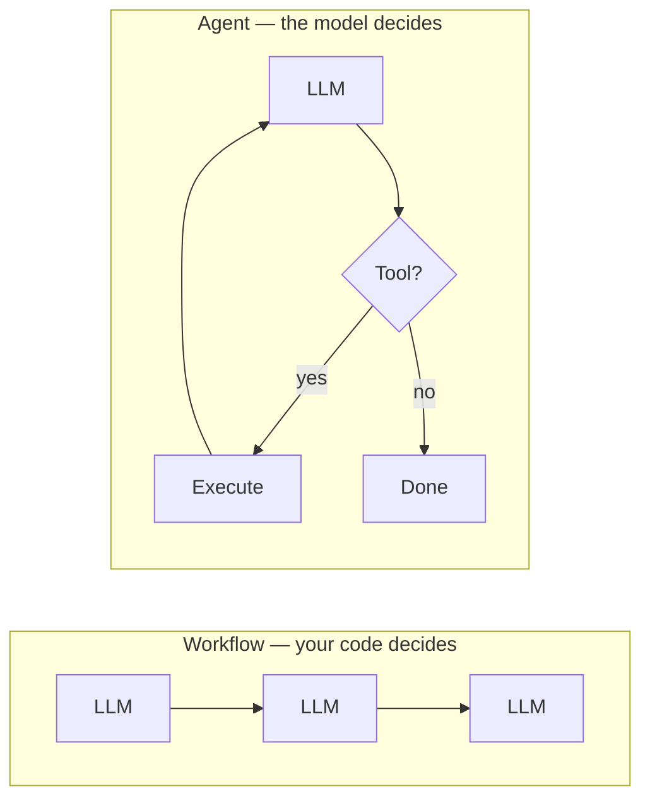
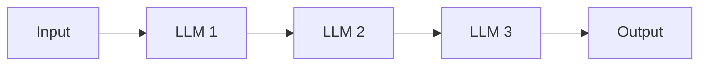
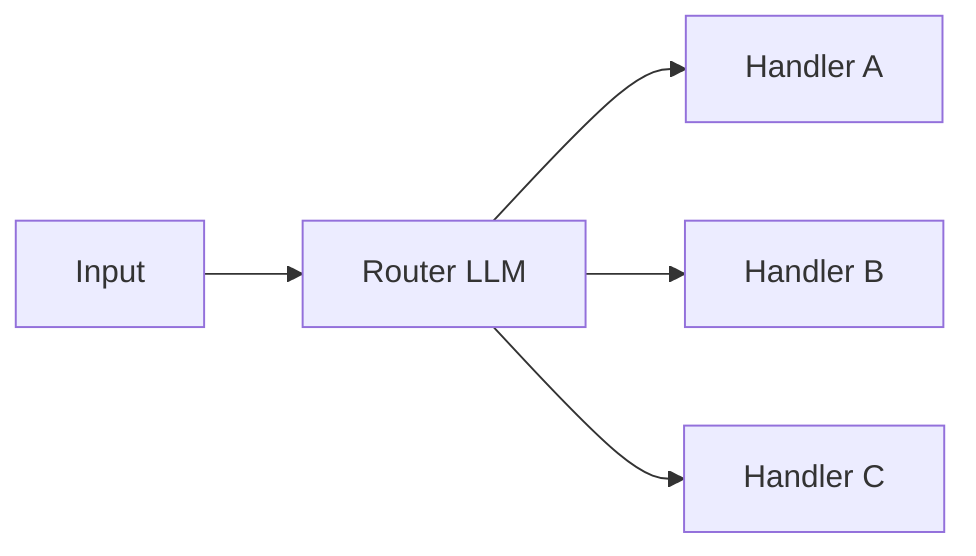
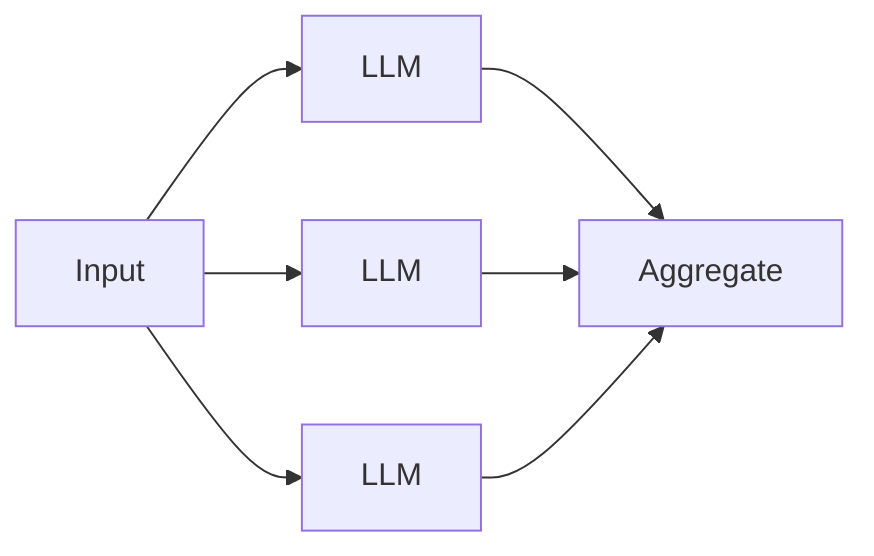
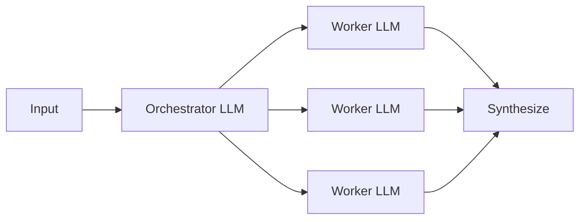
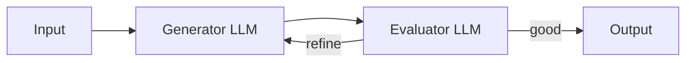
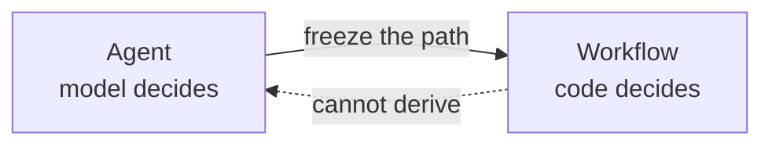

# What is agentic engineering?

**Agentic engineering is the discipline of building agentic systems.**

Working in this discipline involves the following items:

- **Building the control flow** — the control flow determines the path the system takes
- **Designing tools** — what capabilities the system has, at what granularity, with what error semantics.
- **Architecting memory** — what's remembered, when it's remembered, and how it's retrieved
- **Managing context** — the context window is a budget of tokens; determine what goes into context and what gets evicted.
- **Setting up observability** — structured traces of every LLM call, tool call, and state transition to help with debugging and monitoring.
- **Building evaluations** — to benchmark the system's performance and ensure it is meeting the desired goals.
- **Handling safety/guardrails** — identity and access management, sandboxing, input/output detection, human approval gates, etc.
- **Managing cost and latency** — optimize costs and latency by caching, batching, model routing, parallelization, compression, etc.
- **Tuning prompts and context** — behavioral optimization via tuning the system prompt and context management.

## What are agentic systems?

An agentic system is a program that coordinates LLM calls to accomplish a goal. The term **agentic system** from Anthropic's [*Building Effective Agents*](https://www.anthropic.com/engineering/building-effective-agents), is an umbrella term that covers both workflows and agents.

## Types of agentic systems

Agentic systems come in two forms, as defined in Anthropic's [*Building Effective Agents*](https://www.anthropic.com/engineering/building-effective-agents):

**Workflows** — systems where LLMs and tools are orchestrated through **predefined code paths**. Your code decides the sequence of steps and the model follows.

**Agents** — systems where **LLMs dynamically direct their own path through the control flow**. The model decides the sequence.

Both are legitimate agentic systems. This content subscribes to Anthropic's taxonomy.

### Common workflow patterns

**Prompt chaining** — LLM → LLM → LLM, fixed order. Example: outline → draft → polish.

**Routing** — Classify input → dispatch to one of N handlers. Example: support tickets routed to billing / technical / refunds.

**Parallelization** — Run N LLM calls in parallel → aggregate. Example: N perspectives on one question.

**Orchestrator-workers** — One LLM splits work → workers handle sub-tasks. Example: research report with multiple sections.

**Evaluator-optimizer** — Generator → Evaluator → loop until good. Example: draft with a quality-gate loop.

## The Average Joes Lab stance: purist agents only

We believe in the [Anthropic model](https://www.anthropic.com/engineering/building-effective-agents): **a real agent has autonomy over its own control flow.** The model decides what tool to call, what to do with the result, and when the task is done. No predetermined path.

**A workflow is an LLM on rails it can't get off of.** Your code lays the track; the model fills in text at each stop.

From Module 1 on, this content sticks to that strict definition: only systems with autonomous control flow count as agents. Workflows are outside the scope of what follows.

The primitives are the same — LLM calls, tools, context, memory. An agent's control flow is the model making those choices live; a workflow's control flow is you making them in advance. The building blocks transfer; how you orchestrate them into a fixed sequence is its own discipline.

For most production systems a workflow is more reliable, cheaper, and easier to evaluate — build a workflow if you can. But the interesting engineering problems — designing tools the model will use well, managing an open-ended context, making a non-deterministic loop reliable, evaluating a trajectory you can't enumerate — are agent problems. If you want a workflow, compose the primitives from this content into the sequence your problem needs.

## What agents look like

Production examples:

- **Coding agents** — [Claude Code](https://claude.com/claude-code), [Cursor](https://cursor.com), [Devin](https://devin.ai), [Aider](https://aider.chat), [nanoagent](https://github.com/averagejoeslab/nanoagent). The model opens files, edits them, runs tests, iterates.
- **Research agents** — [OpenAI Deep Research](https://openai.com/index/introducing-deep-research/), Claude's research mode. The model searches, synthesizes, digs deeper.
- **Task completion agents** — [SWE-agent](https://swe-agent.com), browser-use agents. The model manipulates a filesystem or GUI to complete a task.

In each case, the next action depends on what the previous action produced. The paths can't be enumerated in advance.

> [!IMPORTANT]
> Most systems marketed as "agents" in 2026 are workflows. That's often the right answer. This content is about the case when it isn't.

---

**Next:** [Module 1: What is an agent?](../../../part-01/modules/01-what-is-an-agent/)
