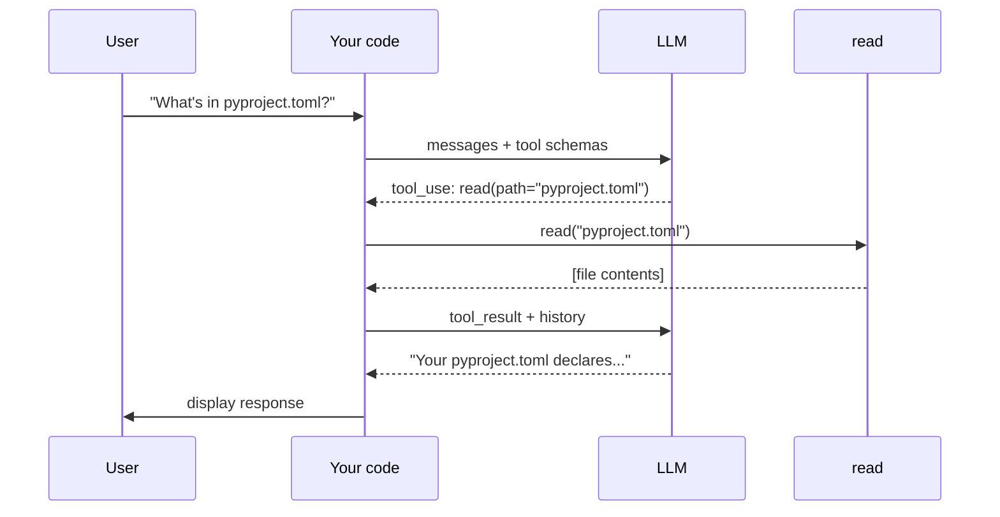

# First tool

This module gives the LLM its first tool — but not yet a loop. What you'll build is a **one-shot workflow**: the model sees a question, requests a single round of tool calls, your code executes them, and the model produces a final response. Two predetermined LLM calls with tool execution between them.

That shape — fixed sequence of LLM calls and code steps — is a workflow per the [taxonomy](../../../../README.md#types-of-agentic-systems) at the top of the repo. The point of building it here is to make the **tool-use protocol** concrete in code before Module 4 wraps it in a loop and turns it into an agent.

## The tool-use protocol

When an LLM has tools available, it can emit `tool_use` blocks in its response. Each is a structured request:

- **`id`** — unique identifier for this specific call
- **`name`** — which tool to run
- **`input`** — the arguments (a dict matching the tool's schema)

Your code runs the tool with those arguments and feeds the result back as a `tool_result` block, matched by `tool_use_id`. The model then produces its next message.

A single response can contain **multiple** `tool_use` blocks. The model can ask to read two files at once, or run three independent commands. They're independent — no reason to run them sequentially.



## Defining a tool

A tool is two pieces, same as Module 1: an **implementation** and a **schema**. The implementation is a function in whatever language you're using; the schema is JSON Schema (LLM industry standard). In our Python agent the implementation is an `async def` and the schema is a plain dict:

```python
async def read(path: str) -> str:
    try:
        with open(path, "r") as f:
            return f.read()
    except Exception as e:
        return f"error: {e}"

tools = [
    {
        "name": "read",
        "description": "Read the contents of a file",
        "input_schema": {
            "type": "object",
            "properties": {
                "path": {"type": "string", "description": "Path to the file to read"},
            },
            "required": ["path"],
        },
    }
]
```

The schema is a [JSON Schema](https://json-schema.org/) dict. Two fields matter for now:

- **`properties`** — what arguments the tool takes and their types
- **`required`** — which arguments are mandatory

The tool returns a string. The `try/except` catches errors (missing file, permission denied) and returns them as strings — so the model can read the error and try again instead of crashing the program. Part 2 covers error design more thoroughly; for now, the pattern to remember is *errors are strings the model can read*.

The function is a coroutine (`async def`) even though the body doesn't currently yield — see "Why parallel tool dispatch" below.

## Why parallel tool dispatch

The model might emit `[tool_use(read, "a.py"), tool_use(read, "b.py")]` in a single response. The two reads don't depend on each other — running them one after the other wastes time.

The pattern every language has for this: **fan out N independent operations, wait for all to finish, receive an ordered list of results.** Python calls it `asyncio.gather`. JavaScript calls it `Promise.all`. Go uses goroutines with a `sync.WaitGroup`. Rust has `futures::join_all`. The name changes; the shape doesn't.

Two properties matter:

- **Concurrency.** The runtime schedules all N operations together so their waits overlap. For one fast file read the speedup is invisible; for a `grep` across thousands of files or a `bash` command that shells out, it's the difference between "wait once" and "wait twice."
- **Order preservation.** Results come back in the same order as the inputs. `outputs[i]` is the result of `tool_calls[i]`, which is how the `zip` below pairs each result back to its originating request.

Setting this up now means every tool we add in Part 2 gets parallelism for free.

## The two-call workflow

Here's the full code. It's a fixed two-call sequence — first call to receive tool requests, second call (after executing them) to receive the final text. The user's question is hardcoded for now; Module 4 turns this into a REPL.

```python
import os
import asyncio
from anthropic import AsyncAnthropic
from dotenv import load_dotenv

load_dotenv()

client = AsyncAnthropic(api_key=os.environ["ANTHROPIC_API_KEY"])


# The tool
async def read(path: str) -> str:
    try:
        with open(path, "r") as f:
            return f.read()
    except Exception as e:
        return f"error: {e}"


tools = [
    {
        "name": "read",
        "description": "Read the contents of a file",
        "input_schema": {
            "type": "object",
            "properties": {
                "path": {"type": "string", "description": "Path to the file to read"},
            },
            "required": ["path"],
        },
    }
]


async def main():
    messages = [{"role": "user", "content": "What's in pyproject.toml?"}]

    # First call: model sees the tools and may emit tool_use blocks
    response = await client.messages.create(
        model="claude-sonnet-4-5",
        max_tokens=1024,
        system="You are a helpful coding assistant. Use the read tool when you need to examine file contents.",
        messages=messages,
        tools=tools,
    )
    messages.append({"role": "assistant", "content": response.content})

    # Execute every requested tool in parallel
    tool_calls = [b for b in response.content if b.type == "tool_use"]
    if tool_calls:
        outputs = await asyncio.gather(*(read(**c.input) for c in tool_calls))
        messages.append({
            "role": "user",
            "content": [
                {"type": "tool_result", "tool_use_id": c.id, "content": o}
                for c, o in zip(tool_calls, outputs)
            ],
        })

        # Second call: model has tool results and produces final text
        response = await client.messages.create(
            model="claude-sonnet-4-5",
            max_tokens=1024,
            system="You are a helpful coding assistant. Use the read tool when you need to examine file contents.",
            messages=messages,
            tools=tools,
        )

    # Print the final text
    for block in response.content:
        if block.type == "text":
            print(block.text)


asyncio.run(main())
```

Three things to notice:

1. **Two `messages.create` calls in fixed order.** Your code decides when each call happens. The model isn't choosing whether to keep going.
2. **Tool execution lives between the two calls.** Your code runs the tools and stitches their results into the message history.
3. **`asyncio.gather` runs every tool concurrently.** With one tool defined, all `tool_use` blocks are calls to `read` — they run in parallel. Order preservation lets the `zip` pair each result back to its originating request.

## Running it

```bash
uv run main.py
```

A run (from your project directory so the relative path works):

```
Your pyproject.toml declares a project named "agent" with Python 3.13+ and anthropic and python-dotenv as dependencies.
```

(Exact phrasing varies — models are non-deterministic.)

## Why this is a workflow, not an agent

Look back at the code. Your code is in charge of the sequence: call the model, run tools, call the model again, print. The whole shape is fixed in advance — the model fills in text and tool requests at each stop, but it doesn't direct the flow.

That's a workflow per the [taxonomy](../../../../README.md#types-of-agentic-systems) — predetermined code paths. The model is on rails.

What if the model's first response asks to read three files, and after seeing them it decides it needs a fourth? In this code, that fourth read can never happen — the second `messages.create` call is the last thing your code does. The model can't change its mind.

## What's missing

- **No iteration.** One round of tool use, then done. The model can't react to what it sees by calling more tools.
- **No conversation.** The user's prompt is hardcoded. No interactive REPL.
- **The agent's autonomy.** Your code decides when to stop, not the model.

Module 4 wraps these two calls in a loop that keeps going until the model emits no more `tool_use` blocks. That's the move from workflow to agent — the model gains control over its own flow.

## Prompt your coding agent

If you want your coding agent to write this for you, paste:

```
Extend main.py from the previous module by adding a single tool called "read" and the tool-use protocol — but no loop yet, just one round of tool calls.

1. Define `async def read(path: str) -> str` that opens the file at `path`, returns its contents, and catches any exception returning the error as a string. It's async even though the body is sync — this lets the executor dispatch multiple tool calls in parallel with asyncio.gather.
2. Define a `tools` list with one entry:
   - name: "read"
   - description: "Read the contents of a file"
   - input_schema: JSON Schema dict with property "path" (string with a short description), required
3. In main(), use a hardcoded user message (e.g., "What's in pyproject.toml?"). Make the first messages.create call with tools=tools.
4. Append the assistant's response to messages, then collect tool_use blocks. If any:
   - Run them in parallel with `outputs = await asyncio.gather(*(read(**c.input) for c in tool_calls))`.
   - Append the tool_result blocks (matching tool_use_id, content=output) as a single user message.
   - Make a second messages.create call (still with tools=tools) so the model can produce its final text.
5. Print any text blocks from the final response.

Do NOT add a while True loop or a REPL — that's Module 4.
```

The prompt tells your agent *what* to write. The module explains *why* — read it first.

---

**Next:** [Module 4: The TAO loop](../04-the-tao-loop/)
