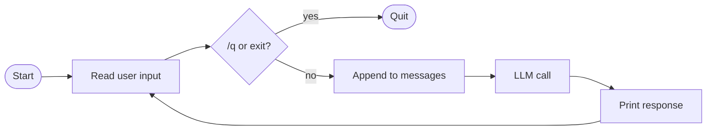

# Multi-turn conversation

Module 2 made one LLM call. This module turns that into a back-and-forth: the user types, the model replies, the user types again, and the conversation history persists so the model can refer to earlier turns. The result is a **chatbot** — interactive, stateful, but still without the ability to take any action in the world.

That distinction matters. A chatbot has the LLM and the loop (around input, not around tool requests), but no tools. By the [taxonomy](../../../../README.md#types-of-agentic-systems) at the top of the repo, that's not yet an agent.

## What "multi-turn" means

The Messages API is stateless. The server doesn't remember anything between calls. To carry conversation forward, you send the *full* prior history with every request — every `{"role": "user", "content": ...}` and `{"role": "assistant", "content": ...}` from the conversation, in order, plus the new user message.

The agent maintains a `messages` list locally:

- After each user input → append `{"role": "user", "content": user_input}`
- After each model response → append `{"role": "assistant", "content": response.content}`
- Send the whole list with the next call

That's the entire mechanism. The server is doing exactly what it did in Module 2, just with a longer `messages` array each turn.

## The terminal REPL

The simplest environment to host an agent is a **REPL**: read a line, evaluate, print, loop. We'll use Python's built-in `input()` for reading and `print()` for writing.



## The code

```python
import os
from anthropic import Anthropic
from dotenv import load_dotenv

load_dotenv()

client = Anthropic(api_key=os.environ["ANTHROPIC_API_KEY"])

messages = []

while True:
    user_input = input("❯ ")
    if user_input.lower() in ("/q", "exit"):
        break

    messages.append({"role": "user", "content": user_input})

    response = client.messages.create(
        model="claude-sonnet-4-5",
        max_tokens=1024,
        system="You are a helpful assistant.",
        messages=messages,
    )
    messages.append({"role": "assistant", "content": response.content})

    for block in response.content:
        if block.type == "text":
            print(block.text)
```

Three things to notice:

1. **`messages` lives outside the loop.** It accumulates across turns. The full history is sent every call.
2. **Each turn appends both the user message and the model's response** — the conversation is the running list.
3. **Sync `input()` is fine.** It blocks the program while waiting for you to type. Nothing else needs to run.

## Running it

```bash
uv run main.py
```

A session:

```
❯ What is 2 + 2?
4
❯ What did I just ask you?
You asked what 2 + 2 equals.
❯ Multiply that answer by 3.
12
❯ /q
```

(Exact phrasing varies — models are non-deterministic.)

The model remembers earlier turns because we send them every time. The third turn's *"that answer"* resolves to *"4"* because the prior exchange is in `messages`.

## Why this is a chatbot, not an agent

Look at what the loop does. It reads input, calls the model, prints the response. The model produces text — nothing more. There's no way for it to look at a file, run a command, or take any action. It can talk; it can't act.

That's a **chatbot**. The loop here is around *input*, not around the model's autonomous decisions. The model isn't choosing whether to keep going — your code is, by reading another line of input.

By the [agent definition](../../../../README.md#types-of-agentic-systems) — *"systems where LLMs dynamically direct their own path through the control flow"* — this isn't one yet. The model has no control flow to direct.

## What's missing

- **No tools.** The model can only produce text. It has no way to look up information, examine files, or take any action in the world.
- **No autonomous control flow.** The loop's exit condition is the user typing `/q`, not the model deciding it's done.
- **No memory across sessions.** The `messages` list lives in memory; the next time you start the script, the conversation starts over.

## Prompt your coding agent

If you want your coding agent to write this for you, paste:

```
Extend main.py from the previous module to support multi-turn conversation in a terminal REPL.

1. Replace the single hardcoded LLM call with a `while True` loop:
   - Read user input with `input("❯ ")`
   - Break if input is "/q" or "exit"
   - Otherwise append it as a user message to a persistent `messages` list

2. Inside each iteration:
   - Call client.messages.create with the full `messages` history
   - Append the response to messages
   - Print each text block from the response

3. Initialize `messages = []` outside the loop so it accumulates across turns.

Use the sync Anthropic client. No tools yet — the model can only respond with text.
```

The prompt tells your agent *what* to write. The module explains *why* — read it first.

---

**Next:** [Module 4: First tool](../04-first-tool/)
