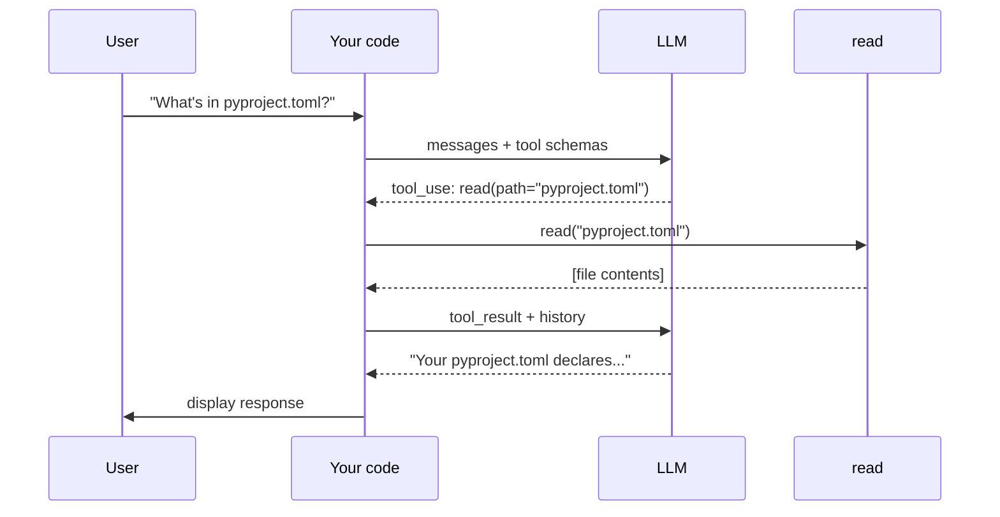

# First tool

Module 3 was a chatbot — the model could talk but couldn't act. This module gives it its first tool. The model emits a `tool_use` block; your code dispatches the tool; the result goes back to the model; the model produces a final response.

What you'll build: the chatbot REPL from Module 3, plus one round of tool dispatch per user turn. Each user prompt triggers up to two LLM calls — one to potentially request tools, one (after dispatch) to produce final text. Per the [taxonomy](../../../../README.md#types-of-agentic-systems), that round of dispatch is a workflow shape inside the chat: your code controls the sequence (call → dispatch → call → print), the model fills in tool requests and text.

## The tool-use protocol

When an LLM has tools available, it can emit `tool_use` blocks in its response. Each is a structured request:

- **`id`** — unique identifier for this specific call
- **`name`** — which tool to run
- **`input`** — the arguments (a dict matching the tool's schema)

Your code runs the tool with those arguments and feeds the result back as a `tool_result` block, matched by `tool_use_id`. The model then produces its next message.

A single response can contain **multiple** `tool_use` blocks. The model can ask to read two files at once, or run three independent commands. They're independent — each one's result feeds back to the model on the same follow-up call.



## Defining a tool

A tool is two pieces, same as Module 1: an **implementation** and a **schema**. The implementation is a function in whatever language you're using; the schema is JSON Schema (LLM industry standard). Both sides in Python:

```python
def read(path: str) -> str:
    try:
        with open(path, "r") as f:
            return f.read()
    except Exception as e:
        return f"error: {e}"

tools = [
    {
        "name": "read",
        "description": "Read the contents of a file",
        "input_schema": {
            "type": "object",
            "properties": {
                "path": {"type": "string", "description": "Path to the file to read"},
            },
            "required": ["path"],
        },
    }
]
```

The schema is a [JSON Schema](https://json-schema.org/) dict. Two fields matter for now:

- **`properties`** — what arguments the tool takes and their types
- **`required`** — which arguments are mandatory

The tool returns a string. The `try/except` catches errors (missing file, permission denied) and returns them as strings — so the model can read the error and try again instead of crashing the program. The pattern to remember is *errors are strings the model can read*.

## The code

Extend Module 3's chatbot with tool definition and one round of dispatch per turn:

```python
import os
from anthropic import Anthropic
from dotenv import load_dotenv

load_dotenv()

client = Anthropic(api_key=os.environ["ANTHROPIC_API_KEY"])


# The tool
def read(path: str) -> str:
    try:
        with open(path, "r") as f:
            return f.read()
    except Exception as e:
        return f"error: {e}"


tools = [
    {
        "name": "read",
        "description": "Read the contents of a file",
        "input_schema": {
            "type": "object",
            "properties": {
                "path": {"type": "string", "description": "Path to the file to read"},
            },
            "required": ["path"],
        },
    }
]


messages = []

while True:
    user_input = input("❯ ")
    if user_input.lower() in ("/q", "exit"):
        break

    messages.append({"role": "user", "content": user_input})

    # First call: model sees the tools and may emit tool_use blocks
    response = client.messages.create(
        model="claude-sonnet-4-5",
        max_tokens=1024,
        system="You are a helpful coding assistant. Use the read tool when you need to examine file contents.",
        messages=messages,
        tools=tools,
    )
    messages.append({"role": "assistant", "content": response.content})

    # If the model requested tools, dispatch them and get a follow-up response
    tool_calls = [b for b in response.content if b.type == "tool_use"]
    if tool_calls:
        results = []
        for c in tool_calls:
            results.append({
                "type": "tool_result",
                "tool_use_id": c.id,
                "content": read(**c.input),
            })
        messages.append({"role": "user", "content": results})

        # Second call: model has tool results, produces final text
        response = client.messages.create(
            model="claude-sonnet-4-5",
            max_tokens=1024,
            system="You are a helpful coding assistant. Use the read tool when you need to examine file contents.",
            messages=messages,
            tools=tools,
        )
        messages.append({"role": "assistant", "content": response.content})

    # Print the final text from the model
    for block in response.content:
        if block.type == "text":
            print(block.text)
```

Three things to notice:

1. **Up to two `messages.create` calls per user turn.** First call may emit `tool_use`; second call (after dispatch) emits final text. If no `tool_use`, we skip the second call.
2. **Tool execution lives between the two calls.** Your code runs the tool and stitches the result into `messages`.
3. **Each `tool_use` block is dispatched in turn.** A `for` loop runs them sequentially and collects `tool_result` blocks for the second call.

## Running it

```bash
uv run main.py
```

A session (run from your project directory so the relative path works):

```
❯ What's in pyproject.toml?
Your pyproject.toml declares a project named "agent" with Python 3.13+ and anthropic and python-dotenv as dependencies.
❯ Does main.py import python-dotenv?
Yes — main.py imports load_dotenv from dotenv.
❯ /q
```

(Exact phrasing varies — models are non-deterministic.)

## Why this is a workflow

Per the [taxonomy](../../../../README.md#types-of-agentic-systems), a workflow is *"systems where LLMs and tools are orchestrated through predefined code paths."*

Within each user turn, the code path is fixed: call model → dispatch tools (once, if requested) → call model → print. The model fills in tool requests and text, but the *sequence* is your code's. The model can't dispatch tools twice in a row within one turn — your code only allows one round.

What if the second response contains another `tool_use` block? It's ignored — the code just prints the text. This is a real limitation: the model can't do multi-step tool work in a single turn. If it needs to read a file and then use that information to decide which file to read next, it has to wait for the user to prompt again.

## What's missing

- **No multi-step tool use within a turn.** If the model needs information from one tool to decide what to do next, it can't act on that decision in the same user turn.
- **Tool execution is sequential.** Multiple `tool_use` blocks in one round run one after another, even though they're independent.
- **The agent's autonomy.** Your code decides when to stop dispatching tools (after one round). The model doesn't.

## Prompt your coding agent

If you want your coding agent to write this for you, paste:

```
Extend main.py from the previous module by adding a single tool called "read" and the tool-use protocol — but only one round of tool dispatch per user turn (no inner loop).

1. Define `def read(path: str) -> str` that opens the file at `path`, returns its contents, and catches any exception returning the error as a string.
2. Define a `tools` list with one entry:
   - name: "read"
   - description: "Read the contents of a file"
   - input_schema: JSON Schema dict with property "path" (string with a short description), required
3. Inside the existing REPL `while True` from the previous module:
   - After each user input, call `messages.create(...)` with `tools=tools`. Append the response to messages.
   - Collect tool_use blocks. If any:
     - Run each in turn with a `for` loop, collecting tool_result blocks (matching tool_use_id, content=read(**c.input)).
     - Append the tool_result blocks as a single user message.
     - Make a second messages.create call (still with tools=tools) so the model can produce its final text.
   - Print any text blocks from the final response.

Do NOT add an inner while True loop — within each user turn, dispatch happens at most once.
```

The prompt tells your agent *what* to write. The module explains *why* — read it first.

---

**Next:** [Module 5: The TAO loop](../05-the-tao-loop/)
