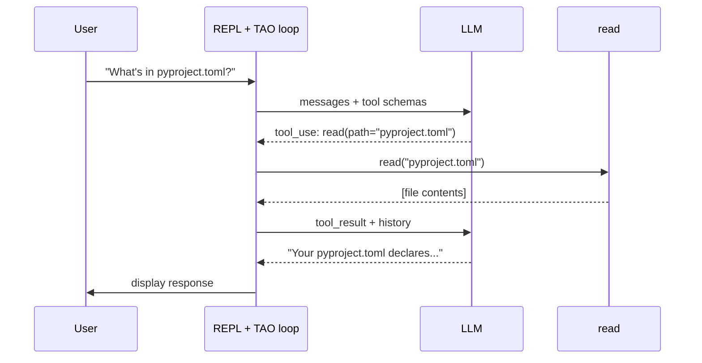

# First tool

This module adds a single tool to the REPL agent from Module 3. With one tool in place, the TAO loop finally iterates — the model decides when to call it, your code executes it, the result flows back. The system crosses the threshold from "chatbot in a loop" to **minimal agent**.

The tool we're adding is `read`: read the contents of a file. That gives the model its first way to reach out of the LLM and into the environment — in this case, the filesystem it's running next to.

## The tool-use protocol

When the LLM has tools, it can emit `tool_use` blocks in its response. Each is a structured request:

- **`id`** — unique identifier for this specific call
- **`name`** — which tool to run
- **`input`** — the arguments (a dict matching the tool's schema)

Your code runs the tool with those arguments and feeds the result back as a `tool_result` block, matched by `tool_use_id`. That's the contract: the model asks, your code answers, the model keeps going.

A single response can contain **multiple** `tool_use` blocks. The model can ask to read two files at once, or run three independent commands. Those requests are independent — no reason to execute them one after the other.



## Defining a tool

A tool is two pieces: an async Python function that does the work, and a schema that tells the model how to call it.

```python
async def read(path: str) -> str:
    try:
        with open(path, "r") as f:
            return f.read()
    except Exception as e:
        return f"error: {e}"

tools = [
    {
        "name": "read",
        "description": "Read the contents of a file",
        "input_schema": {
            "type": "object",
            "properties": {
                "path": {"type": "string", "description": "Path to the file to read"},
            },
            "required": ["path"],
        },
    }
]
```

The schema is a [JSON Schema](https://json-schema.org/) dict. Two fields matter for now:

- **`properties`** — what arguments the tool takes and their types
- **`required`** — which arguments are mandatory

The tool returns a string. The `try/except` catches errors (missing file, permission denied) and returns them as strings — so the model can read the error and try again instead of crashing the loop. Part 2 covers error design more thoroughly; for now, the pattern to remember is *errors are strings the model can read*.

The function is a coroutine (`async def`) even though the body doesn't currently yield. That's so the executor can dispatch multiple tool calls in parallel — the pattern explained next.

## Why parallel tool dispatch

The model might emit `[tool_use(read, "a.py"), tool_use(read, "b.py")]` in a single response. The two reads don't depend on each other — running them one after the other wastes time.

The pattern every language has for this: **fan out N independent operations, wait for all to finish, receive an ordered list of results.** Python calls it `asyncio.gather`. JavaScript calls it `Promise.all`. Go uses goroutines with a `sync.WaitGroup`. Rust has `futures::join_all`. The name changes; the shape doesn't.

Two properties matter:

- **Concurrency.** The runtime schedules all N operations together so their waits overlap. For one fast file read the speedup is invisible; for a `grep` across thousands of files or a `bash` command that shells out, it's the difference between "wait once" and "wait twice."
- **Order preservation.** Results come back in the same order as the inputs. `outputs[i]` is the result of `tool_calls[i]`, which is how the `zip` in the OBSERVE section below pairs each result back to its originating request.

Setting this up now means every tool we add in Part 2 gets parallelism for free.

## Wiring it into the loop

Extend `main.py` from Module 3:

```python
import os
import asyncio
from anthropic import AsyncAnthropic
from dotenv import load_dotenv

load_dotenv()

client = AsyncAnthropic(api_key=os.environ["ANTHROPIC_API_KEY"])


# The tool
async def read(path: str) -> str:
    try:
        with open(path, "r") as f:
            return f.read()
    except Exception as e:
        return f"error: {e}"


tools = [
    {
        "name": "read",
        "description": "Read the contents of a file",
        "input_schema": {
            "type": "object",
            "properties": {
                "path": {"type": "string", "description": "Path to the file to read"},
            },
            "required": ["path"],
        },
    }
]


async def dispatch(call):
    if call.name == "read":
        return await read(**call.input)
    return f"error: unknown tool {call.name}"


async def main():
    messages = []

    while True:
        # The terminal environment: read a user prompt
        user_input = input("❯ ")
        if user_input.lower() in ("/q", "exit"):
            break

        messages.append({"role": "user", "content": user_input})

        # The TAO loop: iterate until the model stops requesting tools
        while True:
            # THINK: call the model (now with tools)
            response = await client.messages.create(
                model="claude-sonnet-4-5",
                max_tokens=1024,
                system="You are a helpful coding assistant. Use the read tool when you need to examine file contents.",
                messages=messages,
                tools=tools,
            )
            messages.append({"role": "assistant", "content": response.content})

            # Display any text the model produced
            for block in response.content:
                if block.type == "text":
                    print(block.text)

            # If the model didn't ask for tools, we're done with this turn
            tool_calls = [b for b in response.content if b.type == "tool_use"]
            if not tool_calls:
                break

            # ACT: execute every requested tool in parallel
            outputs = await asyncio.gather(*(dispatch(c) for c in tool_calls))

            # OBSERVE: append results as the next user message
            messages.append({
                "role": "user",
                "content": [
                    {"type": "tool_result", "tool_use_id": c.id, "content": o}
                    for c, o in zip(tool_calls, outputs)
                ],
            })


asyncio.run(main())
```

Three changes from Module 3:

1. **`tools=tools`** added to the `create()` call — gives the model the schema.
2. **ACT section** fills the stub. `dispatch(call)` picks the tool by name; `asyncio.gather(...)` runs every requested call concurrently. With one tool the branching is trivial — Part 2 replaces it with a proper registry.
3. **OBSERVE section** fills the stub — packages results as `tool_result` blocks with matching `tool_use_id`, then appends them as a user message so the model sees them on the next iteration.

## Running it

```bash
uv run main.py
```

A session (run it from your project directory so the relative paths work):

```
❯ What's in pyproject.toml?
I'll check the file.
Your pyproject.toml declares a project named "agent" with Python 3.13+ and anthropic and python-dotenv as dependencies.
❯ Does main.py import python-dotenv?
Let me look.
Yes — main.py imports load_dotenv from dotenv and calls it before creating the Anthropic client.
❯ /q
```

(Exact phrasing varies — models are non-deterministic.)

The TAO loop now runs **multiple iterations per REPL turn**:

1. **THINK** — model sees the question, emits `tool_use: read(path="pyproject.toml")`
2. **ACT** — `asyncio.gather` dispatches the one call; `read("pyproject.toml")` returns the file contents
3. **OBSERVE** — result appended to messages
4. **THINK (again)** — model now has the file contents, produces summary text
5. No more tool requests → break out of the TAO loop, return to REPL

The dashed boxes in Module 3's diagram are now solid.

## What just changed

- **The TAO loop actually iterates.** Before, it ran exactly once per REPL turn (no tools to request). Now every question that requires a file read causes at least one extra iteration.
- **The model directs the flow.** Your code didn't decide to call `read` — the model did. Your code just executed what was asked for.
- **The system has autonomy over its own control flow.** Given a question it can't answer directly, the model reaches for a tool; given the file contents, it decides what to say next.
- **The agent can now see its environment.** The filesystem was always there; now the model has a way to look at it.
- **Parallel tool calls are free.** If the model asks for two reads at once, both run concurrently.

By the [Anthropic definition](https://www.anthropic.com/engineering/building-effective-agents) from Module 0, this is an agent. Not a chatbot (has tools), not a workflow (the model directs the sequence).

## What's next

The agent works, but it's minimal:

- **Only one tool.** It can read, but it can't write, edit, search, or run anything. A real coding agent needs a toolkit.
- **The executor is ad-hoc.** The `dispatch` function's `if call.name == "read"` branch doesn't scale past a handful of tools.
- **The error-return pattern is there but underspecified.** Errors come back as strings; in Part 2 we'll formalize this as the model's self-correction channel and pull the `try/except` out of every tool into a single executor.
- **No memory across sessions.** The conversation resets every time you restart the REPL.

Part 2 (Tool Design) addresses the first three: a proper tool registry, dispatching executor, error-message design, and a multi-tool toolkit (`read`, `write`, `edit`, `bash`, `grep`, `glob`). Part 3 (Memory and Context) handles the fourth.

## Prompt your coding agent

If you want your coding agent to write this for you, paste:

```
Extend main.py from the previous module by adding a single tool called "read":

1. Define `async def read(path: str) -> str` that opens the file at `path`, returns its contents, and catches any exception returning the error as a string (so the model can self-correct instead of crashing the loop). It's async even though the body is sync — this lets the executor dispatch multiple tool calls in parallel with asyncio.gather.
2. Define a `tools` list with one entry:
   - name: "read"
   - description: "Read the contents of a file"
   - input_schema: JSON Schema dict with property "path" (string with a short description), required
3. Pass tools=tools to the messages.create call
4. Update the system prompt to be a helpful coding assistant that uses the read tool when it needs to examine file contents
5. Fill the ACT stub: write `async def dispatch(call)` that picks the tool by name and awaits it, returning "error: unknown tool {name}" for unknown names. Then run every call in parallel with `outputs = await asyncio.gather(*(dispatch(c) for c in tool_calls))`.
6. Fill the OBSERVE stub: zip tool_calls and outputs into tool_result dicts (matching tool_use_id and content), and append the list as a new user message so they feed back into the next iteration of the TAO loop.
```

The prompt tells your agent *what* to write. The module explains *why* — read it first.

---

**Next:** [Module 5: Tool design](../../../part-02/modules/05-tool-design/)
