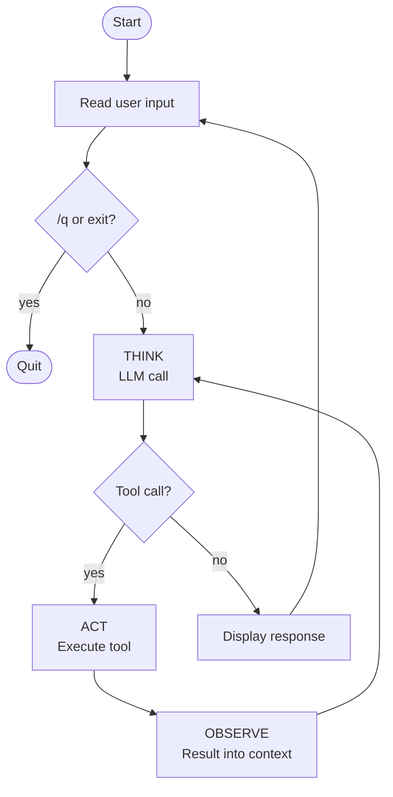

# The TAO loop

Module 3 built a one-shot workflow — two predetermined LLM calls with tool execution between them. This module wraps that workflow in a loop and adds a terminal REPL so the user can have a conversation. The shift turns the workflow into an **agent**: the model decides when to keep calling tools and when to stop. Then, with the loop in place and tool calls flowing, we'll see why parallel tool dispatch matters and refactor to async.

## From workflow to agent

The single change that matters: instead of your code deciding *"call the model exactly twice,"* your code says *"keep calling the model until it stops asking for tools."* The stop condition moves from your code (a fixed count) to the model (its own decision based on what it observes).

Per the [taxonomy](../../../../README.md#types-of-agentic-systems), that's the workflow → agent transition. The model now directs the flow.

## The TAO loop's shape

Each iteration of the loop has three phases:

1. **THINK** — the LLM runs; it emits text and (optionally) tool requests
2. **ACT** — your code executes the tools the model requested
3. **OBSERVE** — the results are appended to the conversation

The loop repeats until the model emits no `tool_use` blocks. A single user prompt can trigger many LLM calls; the model decides how many.

> [!NOTE]
> This loop is commonly known as the **ReAct loop** — after the 2022 paper [*ReAct: Synergizing Reasoning and Acting in Language Models*](https://arxiv.org/abs/2210.03629) by Yao et al. The ReAct acronym drops observation; TAO keeps it visible. (The paper itself includes observation — it's the acronym that's lossy.)

## The environment

An agent doesn't run in a vacuum — it needs somewhere to read input, produce output, and act. The simplest environment is a **terminal REPL**: read a prompt, run the TAO loop, show the response, repeat. The REPL is the outer loop; the TAO loop is the inner one.



## The code

Wrap Module 3's two-call sequence in a `while True` that exits when no `tool_use` blocks come back, then wrap that in an outer REPL loop:

```python
import os
from anthropic import Anthropic
from dotenv import load_dotenv

load_dotenv()

client = Anthropic(api_key=os.environ["ANTHROPIC_API_KEY"])


# The tool (unchanged from Module 3)
def read(path: str) -> str:
    try:
        with open(path, "r") as f:
            return f.read()
    except Exception as e:
        return f"error: {e}"


tools = [
    {
        "name": "read",
        "description": "Read the contents of a file",
        "input_schema": {
            "type": "object",
            "properties": {
                "path": {"type": "string", "description": "Path to the file to read"},
            },
            "required": ["path"],
        },
    }
]


def dispatch(call):
    if call.name == "read":
        return read(**call.input)
    return f"error: unknown tool {call.name}"


messages = []

while True:
    # The terminal environment: read a user prompt
    user_input = input("❯ ")
    if user_input.lower() in ("/q", "exit"):
        break

    messages.append({"role": "user", "content": user_input})

    # The TAO loop: iterate until the model stops requesting tools
    while True:
        # THINK: call the model
        response = client.messages.create(
            model="claude-sonnet-4-5",
            max_tokens=1024,
            system="You are a helpful coding assistant. Use the read tool when you need to examine file contents.",
            messages=messages,
            tools=tools,
        )
        messages.append({"role": "assistant", "content": response.content})

        # Display any text the model produced
        for block in response.content:
            if block.type == "text":
                print(block.text)

        # If the model didn't ask for tools, we're done with this turn
        tool_calls = [b for b in response.content if b.type == "tool_use"]
        if not tool_calls:
            break

        # ACT: execute each requested tool
        results = []
        for c in tool_calls:
            results.append({
                "type": "tool_result",
                "tool_use_id": c.id,
                "content": dispatch(c),
            })

        # OBSERVE: append results as the next user message
        messages.append({"role": "user", "content": results})
```

Three changes from Module 3:

1. **The two `messages.create` calls became one inside `while True`.** The same call runs every iteration; the inner loop stops when no `tool_use` blocks come back. The number of calls is now whatever the model needs.
2. **An outer REPL `while True`.** Reads from stdin, breaks on `/q` or `exit`. `messages` lives outside both loops so the conversation persists across user turns.
3. **A `dispatch(call)` function** picks the tool by name and calls it. With one tool the branching is trivial.

## Running it

```bash
uv run main.py
```

A session (run it from your project directory so the relative paths work):

```
❯ What's in pyproject.toml?
I'll check the file.
Your pyproject.toml declares a project named "agent" with Python 3.13+ and anthropic and python-dotenv as dependencies.
❯ Does main.py import python-dotenv?
Let me look.
Yes — main.py imports load_dotenv from dotenv and calls it before creating the Anthropic client.
❯ /q
```

(Exact phrasing varies — models are non-deterministic.)

The TAO loop now runs **multiple iterations per user turn** when the task needs it:

1. **THINK** — model sees the question, emits `tool_use: read(path="pyproject.toml")`
2. **ACT** — `dispatch` runs the call; `read("pyproject.toml")` returns the file contents
3. **OBSERVE** — result appended to messages
4. **THINK (again)** — model has the file contents, produces summary text
5. No more tool requests → break out of the TAO loop, return to REPL

For simple questions the loop runs once (no tool needed). For multi-step questions ("does X import Y?") the loop iterates until the model is done.

## Why this is now an agent

By the [Anthropic definition](https://www.anthropic.com/engineering/building-effective-agents) the README started with: *"agents are systems where LLMs dynamically direct their own path through the control flow."*

In Module 3, the control flow was your code's two-call sequence. Here, the model's `tool_use` decisions drive the loop — keep going by emitting more tool calls, stop by emitting just text. **The model controls how many iterations happen and what each iteration does.** That's autonomy over control flow.

Not a chatbot (has tools), not a workflow (the model directs the sequence). This is an agent.

## Why async in the loop

Module 3 introduced parallel tool dispatch via `asyncio.gather` — when the model emits multiple `tool_use` blocks in a single response, dispatch them concurrently rather than one at a time. In Module 3's two-call workflow, the savings happened at most once.

The loop changes the math. The agent dispatches tools on *every iteration* of the inner `while True`, and the loop iterates many times across a multi-step task. A single user turn might fan tools out three or four times in a row. Sequential dispatch turns each fan-out's *"wait once for the slowest"* into *"wait for each in turn"* — and now the wait stacks up across the whole conversation.

Same `asyncio.gather` pattern from Module 3, applied inside the loop. The savings compound: every iteration that fans out N tools saves the (N−1) waits, multiplied by however many iterations the loop runs.

## Refactoring to async

Switch the SDK client to `AsyncAnthropic`, wrap the script body in `async def main()`, and replace the `for` loop dispatch with `asyncio.gather`. The rest of the agent's behavior is unchanged.

```python
import os
import asyncio
from anthropic import AsyncAnthropic
from dotenv import load_dotenv

load_dotenv()

client = AsyncAnthropic(api_key=os.environ["ANTHROPIC_API_KEY"])


async def read(path: str) -> str:
    try:
        with open(path, "r") as f:
            return f.read()
    except Exception as e:
        return f"error: {e}"


tools = [
    {
        "name": "read",
        "description": "Read the contents of a file",
        "input_schema": {
            "type": "object",
            "properties": {
                "path": {"type": "string", "description": "Path to the file to read"},
            },
            "required": ["path"],
        },
    }
]


async def dispatch(call):
    if call.name == "read":
        return await read(**call.input)
    return f"error: unknown tool {call.name}"


async def main():
    messages = []

    while True:
        user_input = input("❯ ")
        if user_input.lower() in ("/q", "exit"):
            break

        messages.append({"role": "user", "content": user_input})

        while True:
            response = await client.messages.create(
                model="claude-sonnet-4-5",
                max_tokens=1024,
                system="You are a helpful coding assistant. Use the read tool when you need to examine file contents.",
                messages=messages,
                tools=tools,
            )
            messages.append({"role": "assistant", "content": response.content})

            for block in response.content:
                if block.type == "text":
                    print(block.text)

            tool_calls = [b for b in response.content if b.type == "tool_use"]
            if not tool_calls:
                break

            outputs = await asyncio.gather(*(dispatch(c) for c in tool_calls))
            messages.append({
                "role": "user",
                "content": [
                    {"type": "tool_result", "tool_use_id": c.id, "content": o}
                    for c, o in zip(tool_calls, outputs)
                ],
            })


asyncio.run(main())
```

Four changes from the sync version:

1. **`AsyncAnthropic` instead of `Anthropic`.** The async-flavored client returns awaitables.
2. **`async def` everywhere.** `read`, `dispatch`, and `main` are all coroutines so they can `await`. `read`'s body is still a synchronous file open — the function is async because the executor needs to be able to `await` it.
3. **`await client.messages.create(...)`.** The HTTP call yields while it waits for the API response.
4. **`await asyncio.gather(*(dispatch(c) for c in tool_calls))`.** All requested tools fan out together. The await resumes once every result is in. `outputs` is in the same order as `tool_calls`, so the `zip` pairs each result back to its originating request.

`input()` stays sync. It blocks the event loop while waiting for you to type, but there's nothing else running to block — the REPL is the whole program.

## What just changed

- **The TAO loop iterates.** Module 3 ran tool execution exactly once. Now it runs as many times as the model requests.
- **The model directs the flow.** Your code didn't decide which tool to call or how many — the model did. Your code just executed what was asked for.
- **Conversation persists.** `messages` lives outside the REPL loop so the model remembers earlier turns.
- **Parallel tool calls execute concurrently.** When the model asks for two reads at once, both run together — not one after the other.

## What this didn't address

The agent works but it's minimal:

- **Only one tool.** It can read, but it can't write, edit, search, or run anything.
- **The dispatch is ad-hoc.** The `dispatch(call)` function's `if call.name == "read"` branch doesn't scale past a handful of tools.
- **Errors are caught in the tool, not centrally.** Every new tool will repeat the same `try/except` block.
- **No memory across sessions.** The conversation resets every time you restart the REPL.

## Prompt your coding agent

If you want your coding agent to write this for you, paste:

```
Extend main.py from the previous module to wrap the two-call workflow in a TAO loop and a terminal REPL. Build it sync first, then refactor to async for parallel tool dispatch.

Step 1 — sync version:
1. Replace the hardcoded user message and fixed two `messages.create` calls with two nested `while True` loops at the top level of the script:
   - Outer loop (REPL / terminal environment): read user input with `input("❯ ")`, break if "/q" or "exit", otherwise append as a user message.
   - Inner loop (TAO loop): client.messages.create(...) with messages and tools; append the response to messages; print any text blocks; break if there are no tool_use blocks; otherwise execute every tool with a `for` loop, appending tool_result blocks as a user message; continue.
2. Factor tool execution into `def dispatch(call)` that picks the tool by name and calls it, returning "error: unknown tool {name}" for unknown names.
3. The messages list should live outside both loops so the conversation persists across user turns.
4. Run it. The agent works.

Step 2 — refactor to async for parallel tool dispatch:
1. Switch from Anthropic to AsyncAnthropic.
2. Make read, dispatch, and main async; wrap the entry point in `asyncio.run(main())`.
3. Replace the sync for-loop dispatch with `outputs = await asyncio.gather(*(dispatch(c) for c in tool_calls))`, then build tool_result blocks by zipping tool_calls and outputs.
4. input() stays sync.

Don't change the read function's body or the tools schema — they carry over from Module 3.
```

The prompt tells your agent *what* to write. The module explains *why* — read it first.

---

**Next:** [Module 5: Tool design](../../../part-02/modules/05-tool-design/)
