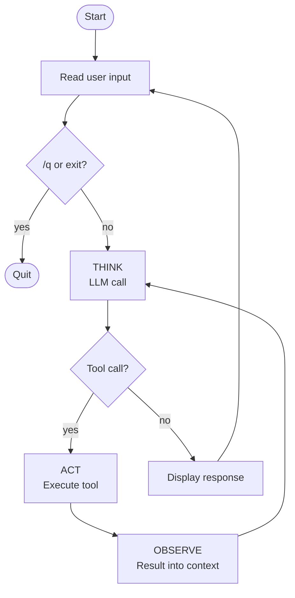

# The TAO loop

Module 4 dispatched tools once per user turn — the model could use a tool, get a result, and produce a final response. If it needed *another* tool based on that result, it had to wait for the next user turn.

This module wraps the tool dispatch in an inner `while True` that keeps going until the model emits no more `tool_use` blocks. Now the model decides when it's done within a single user turn. That's the workflow → agent transition.

## From workflow to agent

In Module 4, the code path within each user turn was fixed: call model → dispatch tools (once, if requested) → call model → print. Your code controlled the sequence; the model picked tools but not iteration count.

Now: call model → if `tool_use`, dispatch and call model again, repeat until no `tool_use` → print. The model controls how many iterations happen. Per the [taxonomy](../../../../README.md#types-of-agentic-systems), that's autonomous control flow — the agent definition.

## The TAO loop's shape

Each iteration of the inner loop has three phases:

1. **THINK** — the LLM runs; it emits text and (optionally) tool requests
2. **ACT** — your code executes the tools the model requested
3. **OBSERVE** — the results are appended to the conversation

Repeats until the response has no `tool_use` blocks.

> [!NOTE]
> This loop is commonly known as the **ReAct loop** — after the 2022 paper [*ReAct: Synergizing Reasoning and Acting in Language Models*](https://arxiv.org/abs/2210.03629) by Yao et al. The ReAct acronym drops observation; TAO keeps it visible. (The paper itself includes observation — it's the acronym that's lossy.)

## The environment

The REPL is the outer loop; the TAO loop is the inner one. Together they look like:



## The code

Wrap Module 4's tool dispatch in an inner `while True` and factor the dispatch into a function:

```python
import os
from anthropic import Anthropic
from dotenv import load_dotenv

load_dotenv()

client = Anthropic(api_key=os.environ["ANTHROPIC_API_KEY"])


# The tool (unchanged from Module 4)
def read(path: str) -> str:
    try:
        with open(path, "r") as f:
            return f.read()
    except Exception as e:
        return f"error: {e}"


tools = [
    {
        "name": "read",
        "description": "Read the contents of a file",
        "input_schema": {
            "type": "object",
            "properties": {
                "path": {"type": "string", "description": "Path to the file to read"},
            },
            "required": ["path"],
        },
    }
]


def dispatch(call):
    if call.name == "read":
        return read(**call.input)
    return f"error: unknown tool {call.name}"


messages = []

while True:
    # The terminal environment: read a user prompt
    user_input = input("❯ ")
    if user_input.lower() in ("/q", "exit"):
        break

    messages.append({"role": "user", "content": user_input})

    # The TAO loop: iterate until the model stops requesting tools
    while True:
        # THINK: call the model
        response = client.messages.create(
            model="claude-sonnet-4-5",
            max_tokens=1024,
            system="You are a helpful coding assistant. Use the read tool when you need to examine file contents.",
            messages=messages,
            tools=tools,
        )
        messages.append({"role": "assistant", "content": response.content})

        # Display any text the model produced
        for block in response.content:
            if block.type == "text":
                print(block.text)

        # If the model didn't ask for tools, we're done with this turn
        tool_calls = [b for b in response.content if b.type == "tool_use"]
        if not tool_calls:
            break

        # ACT: execute each requested tool
        results = []
        for c in tool_calls:
            results.append({
                "type": "tool_result",
                "tool_use_id": c.id,
                "content": dispatch(c),
            })

        # OBSERVE: append results as the next user message
        messages.append({"role": "user", "content": results})
```

Two changes from Module 4:

1. **The conditional second call became one inside `while True`.** The same call runs every iteration; the inner loop stops when no `tool_use` blocks come back. The number of calls is now whatever the model needs.
2. **A `dispatch(call)` function** picks the tool by name and calls it. With one tool the branching is trivial — but factoring it out makes the inner loop's ACT phase cleaner and sets up for more tools later.

## Running it

```bash
uv run main.py
```

A session that demonstrates multi-step tool use in one turn:

```
❯ Find the .py files at the top level and check whether any of them defines a `main` function.
[reads files, looks for main]
There's main.py at the top level; it doesn't define a `main` function — the script body runs at module import time.
❯ /q
```

(Exact phrasing varies — models are non-deterministic.)

The TAO loop runs **multiple iterations per user turn** when the task needs it:

1. **THINK** — model decides what to do, emits `tool_use`
2. **ACT** — `dispatch` runs the call; result returns
3. **OBSERVE** — result appended to messages
4. **THINK (again)** — model has the result; might emit another `tool_use` or just text
5. Repeat until no more `tool_use` → break out of the TAO loop, return to REPL

For simple questions the loop runs once (no tool needed). For multi-step questions the loop iterates as many times as the model requires.

## Why this is now an agent

By the [Anthropic definition](https://www.anthropic.com/engineering/building-effective-agents) the README started with: *"agents are systems where LLMs dynamically direct their own path through the control flow."*

In Module 4, the control flow within each turn was your code's two-call sequence. Here, the model's `tool_use` decisions drive the loop — keep going by emitting more tool calls, stop by emitting just text. **The model controls how many iterations happen and what each iteration does.** That's autonomy over control flow.

Not a chatbot (has tools), not a workflow (the model directs the sequence). This is an agent.

## What just changed

- **The TAO loop iterates.** Module 4 ran tool execution exactly once per turn. Now it runs as many times as the model requests.
- **The model directs the flow.** Your code didn't decide to call `read` twice, or in what order — the model did. Your code just executed what was asked for.
- **Conversation persists.** `messages` lives outside the REPL loop so the model remembers earlier turns.

## What this didn't address

The agent works but it's minimal:

- **Only one tool.** It can read, but it can't write, edit, search, or run anything.
- **The dispatch is ad-hoc.** The `dispatch(call)` function's `if call.name == "read"` branch doesn't scale past a handful of tools.
- **Errors are caught in the tool, not centrally.** Every new tool will repeat the same `try/except` block.
- **Tool execution is sequential.** When the model emits multiple `tool_use` blocks, they run one after another even though they're independent.
- **No memory across sessions.** The conversation resets every time you restart the REPL.

## Prompt your coding agent

If you want your coding agent to write this for you, paste:

```
Extend main.py from the previous module to wrap tool dispatch in an inner while True loop, turning the per-turn workflow into an agent.

1. Inside each user turn, replace the conditional second messages.create call with an inner `while True` loop:
   - At the top of the inner loop, call messages.create(...) with messages and tools; append the response to messages.
   - Print any text blocks the model produced.
   - Collect tool_use blocks; break the inner loop if there are none.
   - Otherwise execute every tool with a `for` loop, append tool_result blocks as a user message, and continue.
2. Factor tool execution into `def dispatch(call)` that picks the tool by name and calls it, returning "error: unknown tool {name}" for unknown names.
3. Don't change the read function or the tools schema — they carry over from the previous module.
4. Keep it sync — no async yet.
```

The prompt tells your agent *what* to write. The module explains *why* — read it first.

---

**Next:** [Module 6: Async and parallel tool dispatch](../06-async-and-parallel-dispatch/)
