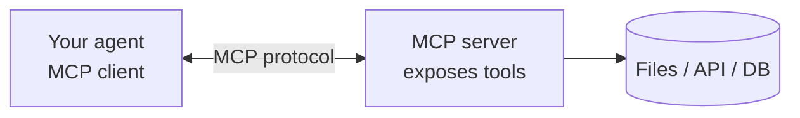

# MCP — Model Context Protocol

The agent from Module 7 defines six tools inline: Python functions plus schemas in a `TOOLS` dict. That works for one agent in one project. It doesn't scale if you have three agents that all need the same tools, or if you want to pull in tools someone else wrote.

**MCP** — [Model Context Protocol](https://modelcontextprotocol.io) — is a standard for exposing tools to agents over a common interface. Instead of each project hand-coding its toolkit, you run MCP *servers* that provide tools, and your agent (the *client*) consumes them.

## What MCP gives you

- **Reusable tools.** A filesystem MCP server can serve `read`/`write`/`edit` to any agent that speaks the protocol.
- **Language-agnostic.** Servers can be written in any language; agents in any language can use them.
- **Composable.** Run multiple servers (filesystem, database, web search) and your agent gets all their tools.
- **Secure boundaries.** Each server is a separate process you can sandbox; permissions are per-server, not per-tool.

The ecosystem is active — Anthropic maintains a reference implementation, and dozens of community-built servers exist for common capabilities.

## How it works (briefly)

An MCP interaction has three actors:

- **Server** — a process you run that exposes a set of tools. It describes them (name, description, schema) over the protocol.
- **Client** — your agent. It lists tools from connected servers, calls them, receives results.
- **Protocol** — JSON-RPC over stdio, HTTP, or WebSocket. You almost never touch the wire format.

From your agent's point of view, an MCP tool looks identical to a local tool. The client library handles discovery, calling, and result serialization.

## MCP vs a custom tool registry

| | Custom registry (Modules 6–7) | MCP |
|---|---|---|
| Setup | Write Python functions + schemas | Install a server |
| Control | Full — you own the code | Per-server; depends on implementation |
| Reuse across agents | Copy/paste code | Connect to the same server |
| Language | Python only | Any (servers are polyglot) |
| Debugging | Easy — all in one file | Cross-process; needs tracing |
| Dependencies | Just your code | Run + manage server processes |

**Rule of thumb**: start with a custom registry for your first agent. Move to MCP when you have ≥2 agents sharing tools, or when a mature MCP server already exists for what you need.

## When to skip it

- You're learning agents (this curriculum through Part 2). Writing the registry yourself is the point.
- Your agent is single-purpose and your toolkit is stable. Extra infrastructure isn't worth it.
- You need tight control over a specific tool's behavior (error formats, ordering, edge cases). Custom code is clearer than patching a server.

## When to reach for it

- You have multiple agents that share a toolkit.
- You want to use tools someone else wrote (filesystem, database, web search, GitHub, Slack, etc.).
- Your agents cross language boundaries (Python + TypeScript + Rust all need the same tools).
- You need to sandbox tools. The server process is a natural boundary.

## The design principles still apply

Whether you write tools for a custom registry or an MCP server, the Module 5 principles are the same:

- Focused granularity
- Errors as self-correction (strings, not exceptions)
- Informative descriptions for the model to read
- Minimal required fields in the schema

An MCP server *is* a registry — just over the wire.

## Further reading

- [modelcontextprotocol.io](https://modelcontextprotocol.io) — spec and reference clients
- [Anthropic's MCP quickstart](https://modelcontextprotocol.io/quickstart) — build a first server and client
- [Community MCP servers](https://github.com/modelcontextprotocol/servers) — filesystem, git, postgres, slack, and more

---

**Next:** Part 3 — Memory and Context *(coming soon)*
