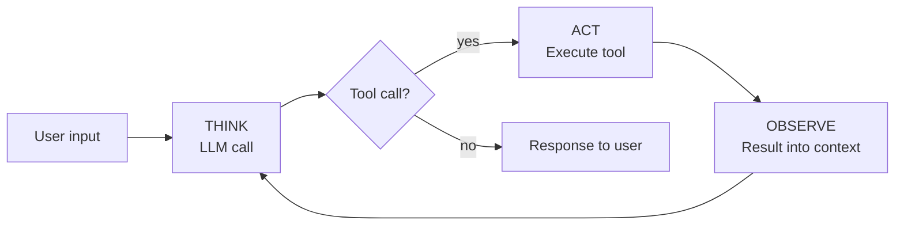

# Add a loop

Module 2 made one LLM call. The model answered and the program ended. To do useful work, the model needs to keep going — across turns of conversation, and across multiple actions within a single turn. This module gets there in four steps.

1. **Multi-turn** — keep talking; the model remembers what was said.
2. **First tool** — give the model a way to act, with your code in charge of when.
3. **TAO loop** — hand control of the loop to the model. *This is the agent.*
4. **Async refactor** — let the model dispatch tools in parallel.

By the end you have the same agent that lives at [`agents/basic-agent`](../../agents/basic-agent/).

## Multi-turn conversation

A single `messages.create` call is stateless — the API doesn't remember anything between calls. To carry state across turns, **you** keep the messages list and send it back every time.

```python
import os
from anthropic import Anthropic
from dotenv import load_dotenv

load_dotenv()
client = Anthropic(api_key=os.environ["ANTHROPIC_API_KEY"])

messages = []

while True:
    user_input = input("❯ ")
    if user_input.lower() in ("/q", "exit"):
        break

    messages.append({"role": "user", "content": user_input})

    response = client.messages.create(
        model="claude-sonnet-4-5",
        max_tokens=1024,
        system="You are a helpful assistant.",
        messages=messages,
    )

    assistant_text = response.content[0].text
    messages.append({"role": "assistant", "content": assistant_text})
    print(assistant_text)
```

Two things to notice:

1. **Every turn sends the full history.** The model has no server-side state — `messages` is the entire conversation each call.
2. **Both sides get appended.** User input goes in before the call; the assistant's reply goes in after.

That's a chatbot. The model can answer questions across turns, but it can't *do* anything — it only emits text.

## Add a tool

A tool is a function the model can ask your code to run. The model declares its intent in a structured `tool_use` block; your code executes the function and feeds the result back.

Three pieces:

1. **The function** — the implementation, in Python.
2. **The schema** — a JSON Schema description the model reads to know what arguments to pass.
3. **The dispatch** — your code spotting the `tool_use` block, running the function, and appending a `tool_result`.

```python
def read(path: str) -> str:
    try:
        with open(path, "r") as f:
            return f.read()
    except Exception as e:
        return f"error: {e}"


tools = [
    {
        "name": "read",
        "description": "Read the contents of a file",
        "input_schema": {
            "type": "object",
            "properties": {"path": {"type": "string"}},
            "required": ["path"],
        },
    }
]
```

The function returns a string. On error, it returns the error message *as a string* instead of raising — the model can read the error and self-correct, where a thrown exception would just kill the program.

Now wire it into one turn:

```python
messages = [{"role": "user", "content": "What's in pyproject.toml?"}]

response = client.messages.create(
    model="claude-sonnet-4-5",
    max_tokens=1024,
    system="You are a helpful coding assistant.",
    messages=messages,
    tools=tools,
)
messages.append({"role": "assistant", "content": response.content})

# Look for a tool_use block
for block in response.content:
    if block.type == "tool_use":
        result = read(**block.input)
        messages.append({
            "role": "user",
            "content": [
                {"type": "tool_result", "tool_use_id": block.id, "content": result}
            ],
        })

# Now ask the model to interpret the result
response = client.messages.create(
    model="claude-sonnet-4-5",
    max_tokens=1024,
    system="You are a helpful coding assistant.",
    messages=messages,
    tools=tools,
)
print(response.content[0].text)
```

Two new wire-format details:

- **`response.content` is a list of blocks**, not just one. With tools enabled, a single response can contain a `text` block, one or more `tool_use` blocks, or both.
- **Tool results come back as a `user` message** with `content` being a list of `tool_result` blocks. Each result is matched to its request by `tool_use_id`.

This works — but notice the structure: **call the model, run the tool, call the model again.** Two calls, hardcoded. What if the model needs to read another file based on what it saw? What if it needs to read three files? The fixed two-call shape doesn't scale.

This is a **workflow** — your code decides the sequence (call → tool → call). For a known task it's fine. For open-ended work, the model needs to decide when it's done.

## Wrap it in a loop

Replace the fixed two calls with a loop. Each iteration: call the model. If it asked for a tool, run it and loop again. If it didn't, the turn is over.

```python
while True:
    user_input = input("❯ ")
    if user_input.lower() in ("/q", "exit"):
        break

    messages.append({"role": "user", "content": user_input})

    # The TAO loop
    while True:
        # THINK: call the model
        response = client.messages.create(
            model="claude-sonnet-4-5",
            max_tokens=1024,
            system="You are a helpful coding assistant. Use the read tool when you need to examine file contents.",
            messages=messages,
            tools=tools,
        )
        messages.append({"role": "assistant", "content": response.content})

        for block in response.content:
            if block.type == "text":
                print(block.text)

        tool_calls = [b for b in response.content if b.type == "tool_use"]
        if not tool_calls:
            break  # Model didn't ask for a tool — turn is over

        # ACT: run each requested tool
        results = []
        for c in tool_calls:
            results.append({
                "type": "tool_result",
                "tool_use_id": c.id,
                "content": read(**c.input),
            })

        # OBSERVE: feed results back as the next user message
        messages.append({"role": "user", "content": results})
```

Two loops, nested:

- **Outer loop** — the conversation. Each iteration is one user turn.
- **Inner loop** — the **TAO loop** (Think → Act → Observe). Each iteration is one model call plus its tool dispatches. The model decides when to stop by simply not requesting more tools.

This is the agent. The control-flow choice — *do I need another tool, or am I done?* — moved from your code into the model. Your code no longer knows in advance how many tool calls a turn will take.

The structure of the TAO loop:



> [!NOTE]
> This is the **ReAct loop** from the 2022 paper [*ReAct: Synergizing Reasoning and Acting in Language Models*](https://arxiv.org/abs/2210.03629) by Yao et al. The ReAct acronym drops observation; TAO keeps it visible.

## Async and parallel tool dispatch

The loop above runs tools one at a time. If the model asks for three file reads, the second waits for the first, the third waits for the second — even though they could run in parallel.

The Anthropic SDK has an `AsyncAnthropic` client that returns coroutines. Combined with `asyncio.gather`, multiple tool calls can run concurrently.

Three changes:

1. Swap `Anthropic` for `AsyncAnthropic`; `await` the API call.
2. Make the tool function `async`.
3. Replace the per-tool loop with `asyncio.gather(*(...))`.

```python
import os
import asyncio
from anthropic import AsyncAnthropic
from dotenv import load_dotenv

load_dotenv()
client = AsyncAnthropic(api_key=os.environ["ANTHROPIC_API_KEY"])


async def read(path: str) -> str:
    try:
        with open(path, "r") as f:
            return f.read()
    except Exception as e:
        return f"error: {e}"


tools = [
    {
        "name": "read",
        "description": "Read the contents of a file",
        "input_schema": {
            "type": "object",
            "properties": {"path": {"type": "string"}},
            "required": ["path"],
        },
    }
]


async def dispatch(call):
    if call.name == "read":
        return await read(**call.input)
    return f"error: unknown tool {call.name}"


async def main():
    messages = []

    while True:
        user_input = input("❯ ")
        if user_input.lower() in ("/q", "exit"):
            break

        messages.append({"role": "user", "content": user_input})

        while True:
            response = await client.messages.create(
                model="claude-sonnet-4-5",
                max_tokens=1024,
                system="You are a helpful coding assistant. Use the read tool when you need to examine file contents.",
                messages=messages,
                tools=tools,
            )
            messages.append({"role": "assistant", "content": response.content})

            for block in response.content:
                if block.type == "text":
                    print(block.text)

            tool_calls = [b for b in response.content if b.type == "tool_use"]
            if not tool_calls:
                break

            # Run all requested tools in parallel
            outputs = await asyncio.gather(*(dispatch(c) for c in tool_calls))

            messages.append({
                "role": "user",
                "content": [
                    {"type": "tool_result", "tool_use_id": c.id, "content": o}
                    for c, o in zip(tool_calls, outputs)
                ],
            })


asyncio.run(main())
```

`asyncio.gather` runs every coroutine concurrently and returns the results in order. For a single tool call it's the same as `await`; for many, it's the sum of work done in parallel rather than in sequence.

## Reference: basic-agent

This is the end state of [`agents/basic-agent`](../../agents/basic-agent/). The file is the same script — copy it, run it, point it at a file:

```bash
cd agents
uv run basic-agent/main.py
```

```
❯ what's in basic-agent/main.py?
[reads the file, summarizes]
❯ /q
```

It has one tool. Real coding agents have a dozen. That's the next module.

## What's missing

- **Only one tool.** Add another and the dispatch grows an `if call.name == ...` branch per tool. That doesn't scale.
- **No state across runs.** Quit the program and the conversation is gone.
- **No safety.** `bash` or `write` tools (next module) can do real damage with no guardrails.

---

**Next:** [Module 4: Add tools](../04-add-tools/)
