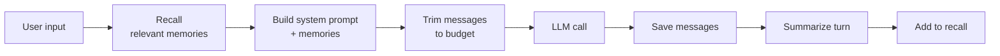

# Add memory

Module 3's chatbot can hold a conversation, but only inside a single session. Quit the program and the messages list — your only state — evaporates. Next session it's a stranger again.

Adding **memory** turns the chatbot into a **stateful chatbot** — one that recognizes you when you come back next week, instead of starting from zero every run. "Memory" sounds like one feature, but it's three distinct problems hiding under one word, and they need different solutions:

1. **Persistence** — the conversation must survive a restart. Save the messages list to disk, load it next session.
2. **Token budget** — the context window has a fixed size; eventually a long conversation overflows it. Trim old turns when needed.
3. **Semantic recall** — even after trimming, useful context shouldn't be lost forever. Summarize each turn into a vector store and pull back relevant pieces by similarity.

By the end you have [`examples/stateful_chatbot.py`](../../examples/stateful_chatbot.py).

## Persistence

The simplest fix: serialize `messages` to JSON at the end of every turn, load it at startup. Pick a state directory under the user's home so it survives reboots and isn't tied to where the program was launched from.

```python
from pathlib import Path
import json

STATE_DIR = Path.home() / ".stateful-chatbot"
MESSAGES_FILE = STATE_DIR / "messages.json"


def _serialize(obj):
    if hasattr(obj, "model_dump"):
        return obj.model_dump()
    raise TypeError(f"can't serialize {type(obj)}")


def load_messages() -> list:
    if not MESSAGES_FILE.exists():
        return []
    try:
        return json.loads(MESSAGES_FILE.read_text())
    except json.JSONDecodeError as e:
        print(f"warning: {MESSAGES_FILE} is corrupt ({e}); starting fresh")
        return []


def save_messages(messages: list) -> None:
    STATE_DIR.mkdir(parents=True, exist_ok=True)
    MESSAGES_FILE.write_text(json.dumps(messages, default=_serialize, indent=2))
```

Two subtleties:

**The SDK returns structured response objects, not raw JSON.** They need to be converted to a serializable form on the way to disk; on reload, the plain JSON shape is fine to send back to the API. (Most language SDKs follow the same pattern — typed objects out, JSON-friendly shape in.)

**Corrupt state shouldn't crash startup.** If the JSON is malformed (interrupted write, manual edit), recover gracefully: warn the user and start fresh. Losing one session is recoverable; failing to start at all is not.

Wire it into the loop — `load_messages()` at startup, `save_messages(messages)` after each turn:

```python
def main():
    messages = load_messages()  # was: messages = []

    while True:
        user_input = input("❯ ")
        if user_input.lower() in ("/q", "exit"):
            break

        # ... call the model, append response ...

        save_messages(messages)
```

That's persistence. Restart the chatbot and the prior conversation comes back.

## Token budget

The context window is a budget of tokens. Each Claude Sonnet 4.5 request can carry up to 200,000 input tokens; with 1M context enabled, up to 1,000,000. A long conversation eventually exceeds whatever budget you've set.

Two pieces are needed:

1. **Count the tokens in the current request.**
2. **If over budget, drop old turns.** But not arbitrarily — drop at *safe boundaries*.

### Counting tokens

The Anthropic API has a `count_tokens` endpoint that returns the exact input-token count for a given request:

```python
count = client.messages.count_tokens(
    model=MODEL,
    system=system,
    messages=messages,
)
print(count.input_tokens)
```

Calling `count_tokens` is far cheaper than calling `messages.create` and lets the chatbot check its own size before sending.

### Dropping at safe boundaries

A naive trim might drop the first message of the list. For a chatbot that's mostly fine, but the rule generalizes badly to richer message shapes (which we'll add in the next module). The safe rule: **only trim at the start of a fresh user turn**.

For a chatbot, every user message is a safe boundary because each `user` entry is a plain string:

```python
def find_safe_truncation_point(messages: list, drop_n: int = 1) -> int:
    boundaries = [i for i, msg in enumerate(messages) if msg["role"] == "user"]
    if drop_n >= len(boundaries):
        return boundaries[-1] if boundaries else 0
    return boundaries[drop_n]


def trim_to_budget(messages: list, budget: int, system: str) -> list:
    while True:
        count = client.messages.count_tokens(
            model=MODEL, system=system, messages=messages,
        )
        if count.input_tokens <= budget or len(messages) <= 1:
            return messages
        truncate_at = find_safe_truncation_point(messages, drop_n=1)
        if truncate_at == 0:
            return messages
        messages = messages[truncate_at:]
```

`trim_to_budget` is a loop: count, drop one turn, count again, until under budget. Call it after appending the new user message and before the model call:

```python
messages.append({"role": "user", "content": user_input})
messages = trim_to_budget(messages, CONTEXT_BUDGET, system)
```

Pick the budget below the model's hard limit. `150_000` for Sonnet 4.5 standard context leaves room for the model's response.

> [!NOTE]
> The next module adds tools, which means messages can carry `tool_use` and `tool_result` blocks. Eviction has to skip user messages that are *replies* to tool calls — splitting a tool_use/tool_result pair makes the API reject the request. We'll extend `find_safe_truncation_point` then.

## Semantic recall

Trimming solves overflow, but everything trimmed is lost — even if the user comes back next week and asks about exactly that. Semantic recall is the bridge: when a turn ends, summarize it; embed the summary; store it. When a new user message arrives, embed it too and pull the most-similar summaries back into the system prompt.

Three pieces:

1. **Embed** — convert text to a vector. We use `sentence-transformers` (a small local model — no API call, no rate limits).
2. **Store** — keep a JSON list of `{text, embedding}` entries. For thousands of entries this is fine; for millions you'd want a vector database.
3. **Recall** — given a query, score each entry by dot product, return the top-k above a similarity threshold.

```python
from sentence_transformers import SentenceTransformer
import numpy as np

print("Loading embedding model...")
_embed_model = SentenceTransformer("all-MiniLM-L6-v2")


def embed(text: str) -> np.ndarray:
    return _embed_model.encode(text, convert_to_numpy=True, normalize_embeddings=True)


def add_to_recall(text: str, entries: list[dict]) -> None:
    vec = embed(text)
    entries.append({"text": text, "embedding": vec.tolist()})
    save_recall(entries)


def recall(query: str, entries: list[dict],
           k: int = 3, threshold: float = 0.3) -> list[str]:
    if not entries:
        return []
    q_vec = embed(query)
    scored = []
    for e in entries:
        e_vec = np.array(e["embedding"])
        score = float(np.dot(q_vec, e_vec))
        scored.append((score, e["text"]))
    scored.sort(reverse=True)
    return [text for score, text in scored[:k] if score >= threshold]
```

Embeddings are normalized to unit length, so dot product equals cosine similarity. The threshold prevents irrelevant entries from leaking in when nothing matches well — better to recall nothing than recall noise.

### Summarizing a turn

Storing raw turn messages would be wasteful — long, full of detail, hard to scan. Summarize each turn down to one paragraph using a cheap model:

```python
def summarize_turn(turn_messages: list) -> str:
    response = client.messages.create(
        model="claude-haiku-4-5",
        max_tokens=200,
        system=("You write one-paragraph summaries of conversations. "
                "Capture what the user asked and what was discussed. "
                "No fluff."),
        messages=[{"role": "user", "content":
                   f"Summarize this exchange:\n\n"
                   f"{json.dumps(turn_messages, default=_serialize)[:8000]}"}],
    )
    return response.content[0].text
```

Haiku is fast and cheap; turn summaries don't need Sonnet's reasoning.

### Wiring recall into the system prompt

When a new user message comes in, recall relevant memories *before* the model call and prepend them to the system prompt:

```python
BASE_SYSTEM = "You are a helpful assistant."

recalled = recall(user_input, recall_entries)
if recalled:
    memory_block = "\n\n".join(f"- {s}" for s in recalled)
    system = f"{BASE_SYSTEM}\n\n## Relevant memory from past conversations\n\n{memory_block}"
else:
    system = BASE_SYSTEM
```

After the turn finishes, summarize and add to recall:

```python
turn_messages = messages[turn_start:]
summary = summarize_turn(turn_messages)
add_to_recall(summary, recall_entries)
```

Now the chatbot has long-term memory: even after old turns are trimmed from the live context, their summaries can be pulled back when the user asks something related.

## Putting it together

The full per-turn shape:



## Run it

The end state is [`examples/stateful_chatbot.py`](../../examples/stateful_chatbot.py):

```bash
cd examples
uv run stateful_chatbot.py
```

State lives in `~/.stateful-chatbot/`:

- `messages.json` — full conversation history.
- `recall.json` — turn summaries with embeddings.

Quit and restart; the conversation is still there. Have a long conversation; the chatbot trims old turns. Ask about something from a week ago; the chatbot recalls the summary.

## Why this still isn't an agent

The chatbot now remembers — but it still can't *do* anything. It can describe how to read a file, recall what you said about a project last month, propose what a config change might look like — but it cannot read, run, or write.

To act, the model needs **tools**. That's the next module — and it's the moment the stateful chatbot becomes a stateful agent.

---

**Next:** [Module 5: Add tools](../05-add-tools/)
